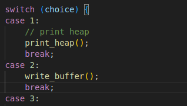

# Verify

This challenge provides very files and a script to decrypt your content. I made a shell script to go through all the files.

```shell
$ for file in files/*; do ./decript.sh $file; done
```

# Scan Surprise

This challenges provides an image with a qrcode, i used zbarimg to decode and see the string

```shell
$ zbarimg flag.png
```

# Binary Search

This challenge gave us a shell script that chose a random number between 1 and 1000 and gave us 10 chances to guess it. I made a Python script to find the number using binary search.

You can access the script [here](./binarySearch.py)

# heap 0

This challenge provides a C code and your executable, the first step was to analyze the C code and understand the execution order. Following I will try discribe the code:

### Step 1
To start I looked for the 'main' function in the file and saw what it does.
The function runs in a 'while' loop that continuously waits for user input. When you enter an option, it triggers the corresponding case in the switch statement. In the option two is possible write buffer and overwrite the variable 'input_data'




#### Step 2
In the function 'write_buffer' you can overwrite the variable 'input_data'. Knowing that, it's possible proceed. Other important function is the 'print_heap' because she prints the memory address and your value, then we can to know when the address overwrote. For example, if put any 'A' chars as input:
```
Welcome to heap0!
I put my data on the heap so it should be safe from any tampering.
Since my data isn't on the stack I'll even let you write whatever info you want to the heap, I already took care of using malloc for you.

Heap State:
+-------------+----------------+
[*] Address   ->   Heap Data   
+-------------+----------------+
[*]   0x5c0dd75c76b0  ->   pico
+-------------+----------------+
[*]   0x5c0dd75c76d0  ->   bico
+-------------+----------------+

1. Print Heap:		(print the current state of the heap)
2. Write to buffer:	(write to your own personal block of data on the heap)
3. Print safe_var:	(I'll even let you look at my variable on the heap, I'm confident it can't be modified)
4. Print Flag:		(Try to print the flag, good luck)
5. Exit

Enter your choice: 2
Data for buffer: AAAAAAAAAAAAAAAAAAAAAAAAAAAAAAAAAAAAAAAAAAAAAAAAAAAAA

1. Print Heap:		(print the current state of the heap)
2. Write to buffer:	(write to your own personal block of data on the heap)
3. Print safe_var:	(I'll even let you look at my variable on the heap, I'm confident it can't be modified)
4. Print Flag:		(Try to print the flag, good luck)
5. Exit

Enter your choice: 1
Heap State:
+-------------+----------------+
[*] Address   ->   Heap Data   
+-------------+----------------+
[*]   0x5c0dd75c76b0  ->   AAAAAAAAAAAAAAAAAAAAAAAAAAAAAAAAAAAAAAAAAAAAAAAAAAAAA
+-------------+----------------+
[*]   0x5c0dd75c76d0  ->   AAAAAAAAAAAAAAAAAAAAA
+-------------+----------------+

1. Print Heap:		(print the current state of the heap)
2. Write to buffer:	(write to your own personal block of data on the heap)
3. Print safe_var:	(I'll even let you look at my variable on the heap, I'm confident it can't be modified)
4. Print Flag:		(Try to print the flag, good luck)
5. Exit

Enter your choice: 
```

### Step 3
The function 'check_win' show the flag if the value is diferent of 'bico'. For this, we are to calculate the quantity of chars to arrive in the 'safe_var' 
0x5c0dd75c76d0 - 0x5c0dd75c76b0 = 0x20 = 32

### Step 4/Resume
With 32 chars it's possible to overwrite safe_var, so follow this order:
```
./chall 

Welcome to heap0!
I put my data on the heap so it should be safe from any tampering.
Since my data isn't on the stack I'll even let you write whatever info you want to the heap, I already took care of using malloc for you.

Heap State:
+-------------+----------------+
[*] Address   ->   Heap Data   
+-------------+----------------+
[*]   0x61deb3d1f6b0  ->   pico
+-------------+----------------+
[*]   0x61deb3d1f6d0  ->   bico
+-------------+----------------+

1. Print Heap:		(print the current state of the heap)
2. Write to buffer:	(write to your own personal block of data on the heap)
3. Print safe_var:	(I'll even let you look at my variable on the heap, I'm confident it can't be modified)
4. Print Flag:		(Try to print the flag, good luck)
5. Exit

Enter your choice: 2
Data for buffer: AAAAAAAAAAAAAAAAAAAAAAAAAAAAAAAA

1. Print Heap:		(print the current state of the heap)
2. Write to buffer:	(write to your own personal block of data on the heap)
3. Print safe_var:	(I'll even let you look at my variable on the heap, I'm confident it can't be modified)
4. Print Flag:		(Try to print the flag, good luck)
5. Exit

Enter your choice: 4

YOU WIN
```

# WebDecode

This challenge provides a URL. While inspecting your pages, I found a strange attribute in the font code on about.html. The attribute contained a Base64-encoded value, which I decoded using a command.
```
echo "cGljb0NURnt3ZWJfc3VjYzNzc2Z1bGx5X2QzYzBkZWRfZGYwZGE3Mjd9"| base64 -d  
```

